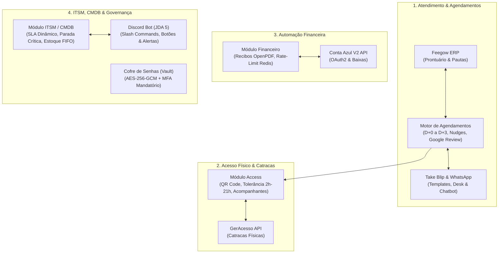

# CTRLS ITSM — Plataforma Integrada de Operações & Automações

O ecossistema **CTRLS ITSM** é uma plataforma White-Label corporativa de integração, automação e gestão tecnológica. A solução unifica o atendimento aos usuários via WhatsApp (Take Blip), o prontuário eletrônico e agendamento (Feegow ERP), a conciliação financeira de recebimentos (Conta Azul V2), o controle de acesso físico por catracas (GerAcesso) e a governança de suporte de TI (ITSM, CMDB, Estoque FIFO e Alertas no Discord).

> [!NOTE]
> 📄 **Relatório Técnico e Post-Mortem do Projeto:**  
> Para ver os detalhes de desenvolvimento, os testes práticos de campo (Java 21 com Virtual Threads, integração com catracas Control iD/GerAcesso, automação de WhatsApp com +11 mil mensagens e vazão de ~500 msgs/min) e o histórico completo do projeto, consulte o [**Relatório Técnico e Post-Mortem**](docs/RELATORIO_DESENVOLVIMENTO_E_POSTMORTEM.md).

---

## 🏛️ Visão Geral dos 4 Pilares do Ecossistema



---

## 📦 Módulos do Sistema (`api/src/main/java/.../modules/`)

A API backend em **Java 21 / Spring Boot 3** é desenhada sob a **Arquitetura Hexagonal (Ports & Adapters)** com 18 módulos delimitados:

1. **`access`**: Integração com catracas físicas (GerAcesso), geração de credenciais/QR Codes, acompanhantes e tolerância de horários.
2. **`admin`**: Gestão administrativa de profissionais, parametrização de pautas e controles globais.
3. **`analytics`**: Dashboards executivos de confirmações, taxas de comparecimento e métricas financeiras.
4. **`appointment`**: Ingestão matinal, esteira de confirmações, nudges recorrentes, regras anti-loop/anti-regressão e Google Review.
5. **`asset`**: Gestão de ativos físicos (CMDB), computadores multi-usuário e rastreamento de ordens de manutenção.
6. **`audit`**: Trilha de auditoria LGPD imutável (`audit_logs`) com Correlation/Trace IDs assíncronos.
7. **`auth`**: Autenticação stateless JWT, MFA/TOTP com Google Authenticator e recuperação de senhas.
8. **`communication`**: Roteadores de webhooks e dispatchers de mensagens.
9. **`finance`**: Conciliação Conta Azul V2, emissão e despacho de recibos em PDF e monetização de médicos.
10. **`inventory`**: Controle de insumos de TI, deduções transacionais por algoritmo FIFO e alertas de estoque mínimo (`min_stock`).
11. **`knowledge`**: Base de conhecimento corporativa (FAQ TI) para autoatendimento e padronização.
12. **`network`**: Probes de infraestrutura e monitoramento de conectividade de rede.
13. **`notification`**: Bot do Discord (JDA 5) com Slash Commands (`/ti status`, `/solicitar`), botões de assumir/recusar chamados e alertas de parada crítica.
14. **`report`**: Geração de relatórios gerenciais e exportação de PDFs estruturados (OpenPDF).
15. **`settings`**: Configurações dinâmicas persistidas e parâmetros de ambiente.
16. **`ticket`**: Central de chamados (ITSM), cálculo de SLA em horas úteis, subchamados (`parent_ticket_id`) e tags com macros de 1 clique.
17. **`user`**: Cadastro de colaboradores, setores organizacionais (`sectors`) e papéis de acesso (`ADMIN`, `TECHNICIAN`, `USER`).
18. **`vault`**: Cofre de senhas e arquivos criptografado com AES-256-GCM com proteção MFA obrigatória.

---

## 📚 Índice da Documentação Técnica

| Documento | Descrição |
| :--- | :--- |
| 🏛️ [**Arquitetura e Modelo de Dados**](docs/ARCHITECTURE.md) | Padrão Hexagonal, divisão de camadas, histórico de 55 migrações do Flyway, dicionário completo de tabelas e diagrama ERD. |
| ⚡ [**Catálogo de Funcionalidades e Regras**](docs/FEATURES.md) | Especificação das regras de negócio: Ingestão de consultas, confirmações em grupo com acumulador atômico, menus numéricos no WhatsApp, controle de catracas com reativação dinâmica e cache offline, totem de autoatendimento, SLA de TI, parada crítica e FIFO de estoque. |
| 🔌 [**Manual de Integrações e APIs**](docs/INTEGRATIONS.md) | Contratos de integração: Feegow ERP (13 status oficiais), Take Blip (Dual-Scope Router + Desk + Menus Interativos), GerAcesso (protocolo tipovisista: 1, auto-retry, reativação imediata e anti-passback), Conta Azul V2 e Discord JDA 5. |
| 🛠️ [**Guia do Desenvolvedor e Operações**](docs/DEVELOPER_GUIDE.md) | Setup do ambiente local, dicionário de variáveis de ambiente (`.env`), observabilidade (Prometheus/Grafana), linter/build do frontend, runbooks de resolução de incidentes e procedimento seguro de backup e desativação (decommissioning). |
| 📜 [**Relatório de Desenvolvimento e Post-Mortem**](docs/RELATORIO_DESENVOLVIMENTO_E_POSTMORTEM.md) | Documento executivo e técnico detalhando a trajetória de Março a Setembro de 2026, com 19 desafios de engenharia superados, matriz de entregas e propriedade intelectual. |

---

## 🚀 Inicialização Rápida

### 1. Pré-requisitos
- **Java JDK 21** & **Maven 3.9+** (ou `./mvnw`)
- **Node.js 20+** & **npm**
- **Docker & Docker Compose**

### 2. Subir Infraestrutura Local (PostgreSQL, Redis e Prometheus)
```bash
# Na raiz do projeto
docker compose up -d db redis prometheus
```

### 3. Configurar Variáveis de Ambiente
```bash
cp .env.example .env
cp .env.example api/.env
```

### 4. Executar a API Backend (Porta 8085)
```bash
cd api
./mvnw clean compile
./mvnw spring-boot:run
```

### 5. Executar o Frontend React (Porta 5173)
```bash
cd front
npm install
npm run dev
```

---

## 🔄 Deploy em Produção

No servidor de produção:
```bash
cd /opt/ctrls-itsm/CTRLS-ITSM
git pull
docker compose down
docker compose up -d --build
docker compose logs -f api
```

A documentação interativa Swagger/OpenAPI está acessível localmente em `http://localhost:8085/api/swagger-ui.html` ou pelo contrato em [openapi.yaml](docs/openapi.yaml).

---

## ⚖️ Licença & Propriedade Intelectual

Este ecossistema é protegido por direitos autorais sob licença proprietária de **Victor Gabriel Hass**. Visualização, estudo técnico e avaliação de engenharia são permitidos para fins acadêmicos (TCC) e de recrutamento profissional (portfólio). Uso comercial, redistribuição ou implantação em produção sem autorização prévia por escrito são expressamente proibidos. Consulte o arquivo [LICENSE](LICENSE) para mais detalhes.

