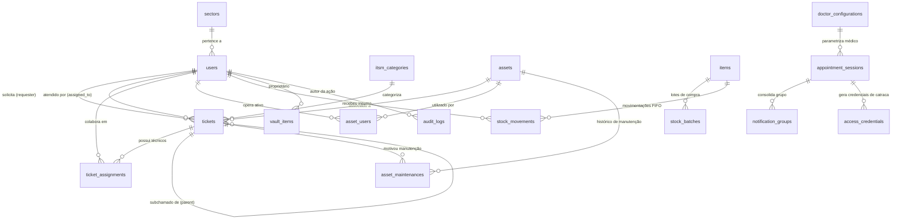

# Arquitetura do Sistema e Modelo de Dados — CTRLS ITSM

Este documento descreve a arquitetura hexagonal (Ports & Adapters) adotada no backend Java 21 / Spring Boot 3, a modularização de serviços no frontend React 19 e o dicionário de dados do banco de dados relacional PostgreSQL 16 com histórico completo de 56 migrações gerenciadas pelo Flyway.

---

## 1. Estrutura Arquitetural do Sistema

O ecossistema CTRLS ITSM é estruturado sob contêineres Docker independentes e escaláveis:

1. **Frontend SPA (React 19 + Vite + TypeScript):** Interface moderna com `ErrorBoundary` nativo, Document Metadata declarativo, paginação totalizada dinâmica, `SearchableDropdown` com catálogo completo e particionamento inteligente de bundles (`vendor-react` com apenas 231 kB).
2. **Backend API (Java 21 + Spring Boot 3):** Núcleo de alta performance utilizando **Virtual Threads (Project Loom)** para concorrência e I/O leve. Implementa o padrão de **Arquitetura Hexagonal (Ports & Adapters)** para isolar regras de negócio corporativas de dependências de frameworks.
3. **Banco de Dados Relacional (PostgreSQL 16):** Armazenamento transacional com suporte a JSONB, integridade referencial com chaves estrangeiras indexadas e controle incremental de evolução de schema via **Flyway Migrations (V1 a V56)**.
4. **Cache Distribuído & Rate Limiting (Redis):** Cache de tokens de alta frequência e limitador de taxa distribuído (`RedisRateLimiter`) com fallback síncrono em memória.
5. **Observabilidade (Prometheus + Grafana):** Coleta de métricas Micrometer expostas no endpoint `/api/actuator/prometheus`.

---

### 1.1 Camada Backend: Arquitetura Hexagonal (Ports & Adapters)

O código-fonte do backend está localizado em `api/src/main/java/br/dev/ctrls/itsm/modules/`, dividido em 18 contextos delimitados:


```
br.dev.ctrls.itsm.modules.<modulo>/
├── domain/                      <-- Core do Domínio (Regras puras, sem frameworks)
│   ├── model/                   <-- Entidades e Value Objects
│   ├── exception/               <-- Exceções de domínio
│   └── port/                    <-- Contratos de fronteira (Interfaces)
│       ├── input/               <-- Casos de Uso (Portas de Entrada)
│       └── output/              <-- SPI / Adaptadores Externos (Portas de Saída)
│
├── application/                 <-- Camada de Aplicação e Orquestração
│   ├── usecase/                 <-- Implementação transacional dos casos de uso
│   └── service/                 <-- Serviços auxiliares e orquestradores de regras
│
└── infrastructure/              <-- Adaptadores Tecnológicos (Spring, DB, APIs)
    ├── adapter/
    │   ├── input/               <-- REST Controllers (@RestController) e Event Listeners
    │   └── output/              <-- Repositórios JPA (@Repository), Clientes HTTP LIME/REST
    ├── config/                  <-- Beans e configurações específicas (@Configuration)
    └── utils/                   <-- Utilitários do módulo
```

#### Mapeamento dos 18 Módulos de Domínio:
* **`access`**: Controle de catracas físicas (GerAcesso), geração de QR Codes, credenciais e acompanhantes.
* **`admin`**: Controles de gestão de pautas médicas, flags de ativação e auditoria administrativa.
* **`analytics`**: Consolidação de KPIs de atendimento, taxa de presença e métricas financeiras.
* **`appointment`**: Ingestão matinal de consultas, esteira de confirmações, nudges e Google Review.
* **`asset`**: Inventário de hardware e equipamentos corporativos (CMDB).
* **`audit`**: Trilha de conformidade LGPD imutável (`audit_logs`) com Correlation e Trace IDs.
* **`auth`**: Autenticação stateless JWT, MFA/TOTP (Google Authenticator) e controle de sessões.
* **`communication`**: Roteadores de webhooks e dispatchers de mensagens.
* **`finance`**: Conciliação Conta Azul V2, geração e despacho de recibos e monetização.
* **`inventory`**: Controle de insumos de TI, movimentações de estoque e dedução via FIFO.
* **`knowledge`**: Base de conhecimento interna (FAQ TI) para autoatendimento técnico.
* **`network`**: Probes de infraestrutura e monitoramento de conectividade de rede.
* **`notification`**: Integração com bot do Discord (JDA 5) e alertas ricos em tempo real.
* **`report`**: Geração de relatórios gerenciais e exportação de PDFs estruturados (OpenPDF).
* **`settings`**: Configurações dinâmicas persistidas e parâmetros de ambiente.
* **`ticket`**: Central de chamados (ITSM), cálculo de SLA em horas úteis e subchamados.
* **`user`**: Cadastro de colaboradores, setores organizacionais (`sectors`) e papéis de acesso.
* **`vault`**: Cofre de senhas e arquivos criptografado com AES-256-GCM.

---

## 2. Histórico de Evolução do Banco de Dados (Flyway Migrations V1 a V49)

O controle do schema do PostgreSQL 16 é efetuado de forma cronológica e imutável via arquivos SQL na pasta `api/src/main/resources/db/migration/`:

* **V1 (Inicialização Base):** Criação das tabelas centrais: `users`, `sectors`, `ticket_categories`, `tickets`, `items`, `item_categories`, `stock_batches`, `stock_movements`, `assets`, `asset_categories`, `asset_maintenances`, `vault_items` e `audit_logs`.
* **V2 (Setup de Produção):** Ajustes de chaves estrangeiras e índices padrão.
* **V3 (Documento Médico):** Adição de colunas de identificação médica no mapeamento de profissionais.
* **V4 (Setup do Motor de Agendamentos):** Criação das tabelas `appointment_sessions` e `appointment_doctor_mapping`.
* **V5 (Consolidação do Motor):** Índices de busca rápida por status e telefone nas sessões de agendamento.
* **V6 (Rastreabilidade de Auditoria):** Inclusão da coluna `trace_id` na tabela `audit_logs`.
* **V7 (Resolução de Chamados):** Adição da coluna `solution_text` na tabela `tickets`.
* **V8 (Relações e Tags de Chamados):** Tabela autorreferencial `ticket_relations` e tags iniciais.
* **V9 (Ativos Multi-usuário):** Criação da tabela de junção `asset_users` para permitir múltiplos colaboradores por computador.
* **V10 (Grupos de Notificação):** Criação da tabela `notification_groups` para agrupar múltiplas consultas do mesmo paciente.
* **V11 (Controle de Nudges):** Inclusão da coluna `last_notification_sent_at` na tabela `appointment_sessions`.
* **V12 (Bloqueio de Agenda Automática):** Flag `ignore_auto_schedule` na tabela `appointment_doctor_mapping`.
* **V13 (Template de Notificação em Grupo):** Suporte ao template consolidado de WhatsApp.
* **V14 (Vínculo de Grupo):** Inclusão da coluna `current_group_id` na tabela `appointment_sessions`.
* **V15 (Base de Conhecimento):** Criação da tabela `faq_ti` para artigos de suporte.
* **V16 (Índices de Performance):** Otimização de consultas críticas no banco.
* **V17 (ITSM, SLA e Múltiplos Afetados):** Tabela `itsm_categories` com `sla_hours` e tabela de junção `ticket_additional_users`.
* **V18 (Ativação de Setores):** Coluna `active` na tabela `sectors` e proteção de integridade em `asset_users`.
* **V19 (Tags Ricas e Ativos Críticos):** Tabela `ticket_tags` (cores hexadecimais e `default_resolution`), `ticket_tag_relations`, coluna `is_critical` em `assets` e `asset_id` em `tickets`.
* **V20 (Destinatário de Estoque):** Coluna `recipient_user_id` na tabela `stock_movements`.
* **V21 (Reconciliação de Identidades Blip):** Ajuste no armazenamento de identificadores do WhatsApp.
* **V22 (Telefone do Grupo):** Coluna `phone_number` na tabela `notification_groups`.
* **V23 (Texto Pré-compilado de Grupo):** Coluna `pre_compiled_schedule_text` na tabela `notification_groups`.
* **V24 (Mapeamento de Nudge V2):** Suporte a templates dinâmicos de lembrete.
* **V25 (Configuração de Nudges de Grupo):** Parâmetros de disparo unificado de lembretes.
* **V26 (Status de Recibos):** Ajuste de enum e rastreabilidade na tabela `processed_receipts`.
* **V27 (Requisições de Itens):** Criação da tabela `ticket_item_requests`.
* **V28 (Novas Aquisições no CMDB):** Flag `is_new_acquisition` na tabela `assets`.
* **V29 (Falhas de Entrega Blip):** Tabela `blip_delivery_failures` para dead-letter de mensagens.
* **V30 (Índice Composto de Tickets):** Índice em `status` + `created_at` na tabela `tickets`.
* **V31 (Integridade de Banco):** Limpeza e consolidação de constraints.
* **V32 (Relacionamentos de Inventário):** Vínculos entre lotes de compra e requisições de chamado.
* **V33 (Alocações de Ativos):** Associação direta de itens a ativos específicos.
* **V34 (Estoque Mínimo):** Coluna `min_stock` na tabela `items` para alertas automáticos de reposição.
* **V35 (Higienização de Mapeamento Médico):** Remoção de links externos legados.
* **V36 (Restauração de Coluna):** Restauração defensiva de `profissional_nome` em `appointment_doctor_mapping`.
* **V37 (Faturamento de Médicos):** Colunas de comissão e cobrança na tabela `appointment_doctor_mapping`.
* **V38 (Vínculo ITSM/CMDB):** Adição da coluna `ticket_id` na tabela `asset_maintenances`.
* **V39 (Tuning de Autovacuum):** Otimização de parâmetros do PostgreSQL na tabela `audit_logs`.
* **V40 (Credenciais de Catracas):** Criação da tabela `access_credentials` (QR Codes, localizadores e acompanhantes).
* **V41 (Idempotência de Acesso):** Constraint UNIQUE em `access_credentials` (`feegow_appointment_id`, `cpf`, `user_type`).
* **V42 (Múltiplas Atribuições de Chamados):** Criação da tabela `ticket_assignments`.
* **V43 (Subchamados e Hierarquia ITSM):** Coluna `parent_ticket_id` na tabela `tickets`.
* **V44 (Seed de Configurações Médicas):** Carga inicial na tabela `doctor_configurations`.
* **V45 (Antecedência e Deslocamento):** Colunas `advance_notice_days` e `time_shift_minutes` em `doctor_configurations`.
* **V46 (Ativação de Médicos):** Coluna `is_active` na tabela `doctor_configurations`.
* **V47 (Constraint de Status de Agendamento):** Ajuste de constraints e suporte ao status `CONFIRMED`.
* **V48 (Google Review URL):** Coluna `google_review_url` na tabela `doctor_configurations`.
* **V49 (Higienização e Índices Finais):** Índices de alta performance em `appointment_sessions`, `notification_groups` e `doctor_configurations`.
* **V50 (Canal do Discord por Médico):** Coluna `discord_channel_id` na tabela `doctor_configurations` para roteamento segmentado de alertas clínicos.
* **V51 (Normalização de Médicos e Limpeza Legada):** Remoção de tabelas legadas e consolidação definitiva do catálogo em `doctor_configurations` com suporte financeiro Conta Azul.
* **V52 (Restauração de Retry e Índices de FKs):** Restauração da tabela `processing_attempts` para controle de retries de notas fiscais Conta Azul, adição de 8 índices em Foreign Keys e índices de busca em `audit_logs` e `notification_groups`.
* **V53 (Telefone em Credenciais de Acesso):** Coluna `phone` na tabela `access_credentials` para persistir o telefone/WhatsApp do paciente ou acompanhante durante o auto-cadastro ou check-in no totem.
* **V54 (Médico Associado em Credenciais de Acesso):** Coluna `doctor_name` na tabela `access_credentials` para armazenar o médico ou especialidade atendente diretamente na credencial, permitindo exibição contextual na carteira digital e totem.
* **V55 (Sincronização de Médicos e Agendas):** Sincronização em massa do catálogo clínico: ativação com defaults de 51 médicos clínicos aprovados, desativação de 6 profissionais com atendimento suspenso/exclusivo e bloqueio preventivo de 8 agendas de testes e procedimentos administrativos.

---

## 3. Dicionário de Tabelas do Banco de Dados

### 3.1 Módulo de Agendamentos & Médicos

#### Tabela: `appointment_sessions`
| Coluna | Tipo | Restrições | Descrição |
|---|---|---|---|
| `id` | `uuid` | PK, default `gen_random_uuid()` | Identificador único da sessão |
| `feegow_appointment_id` | `varchar(50)` | NOT NULL, INDEX | ID do agendamento no Feegow ERP |
| `patient_id` | `varchar(50)` | NOT NULL | ID do prontuário do paciente no Feegow |
| `phone_number` | `varchar(50)` | NOT NULL, INDEX | Telefone no formato WhatsApp (`5542...`) |
| `doctor_profissional_id`| `varchar(50)` | NOT NULL | ID do profissional no Feegow |
| `appointment_at` | `timestamp` | NOT NULL | Data e hora agendada para a consulta |
| `status` | `varchar(30)` | NOT NULL | `PENDING`, `CONFIRMED`, `ALTERATION_REQUESTED`, `CANCELED`, `CANCELED_NO_RESPONSE` |
| `status_details` | `varchar(255)` | NULLABLE | Detalhe da transição (ex: `CONFIRMED_ON_FEEGOW`) |
| `current_group_id` | `uuid` | NULLABLE, FK -> `notification_groups(group_id)` | Vínculo com o grupo de notificações do dia (V14) |
| `last_notification_sent_at`| `timestamp` | NULLABLE | Instante do último disparo de template ou nudge (V11) |
| `last_interaction_at` | `timestamp` | NULLABLE | Instante da última resposta recebida do paciente |
| `closed_at` | `timestamp` | NULLABLE | Instante do encerramento da sessão |
| `created_at` | `timestamp` | NOT NULL, default `now()` | Data de criação do registro |

#### Tabela: `notification_groups`
| Coluna | Tipo | Restrições | Descrição |
|---|---|---|---|
| `id` | `uuid` | PK, default `gen_random_uuid()` | Identificador do registro |
| `group_id` | `uuid` | NOT NULL, INDEX | UUID compartilhado entre consultas unificadas |
| `session_id` | `uuid` | NOT NULL, FK -> `appointment_sessions(id)` | Sessão vinculada ao grupo |
| `phone_number` | `varchar(50)` | NULLABLE | Telefone do paciente notificado (V22) |
| `pre_compiled_schedule_text`| `text` | NULLABLE | Resumo textual consolidado das consultas (V23) |
| `created_at` | `timestamp` | NOT NULL | Data de geração do grupo |

#### Tabela: `doctor_configurations`
| Coluna | Tipo | Restrições | Descrição |
|---|---|---|---|
| `id` | `uuid` | PK, default `gen_random_uuid()` | Identificador único |
| `feegow_profissional_id`| `integer` | NOT NULL, UNIQUE | ID do profissional no Feegow ERP |
| `doctor_name` | `varchar(150)` | NOT NULL | Nome de exibição do médico |
| `advance_notice_days` | `integer` | NOT NULL, default `1` | Dias de antecedência para disparo (ex: 2 para D+2) |
| `time_shift_minutes` | `integer` | NOT NULL, default `0` | Deslocamento de instrução de chegada |
| `google_review_url` | `varchar(500)` | NULLABLE | Link direto para avaliação no Google Meu Negócio |
| `discord_channel_id`| `varchar(50)` | NULLABLE | ID do canal no Discord exclusivo para alertas deste médico (V50) |
| `contaazul_customer_uuid`| `varchar(64)` | NULLABLE, UNIQUE | UUID do cliente correspondente no Conta Azul V2 (V51) |
| `doctor_email` | `varchar(255)` | NULLABLE | E-mail do médico para envio de relatórios e faturamento (V51) |
| `doctor_cpf_cnpj` | `varchar(20)` | NULLABLE | CPF ou CNPJ do médico para emissão fiscal (V51) |
| `is_active` | `boolean` | NOT NULL, default `true` | Habilita/desabilita o motor de agendamentos e catracas para este médico |
| `created_at` | `timestamp` | NOT NULL | Data de cadastro |

---

### 3.2 Módulo de Controle de Acesso Físico (Catracas)

#### Tabela: `access_credentials`
| Coluna | Tipo | Restrições | Descrição |
|---|---|---|---|
| `id` | `uuid` | PK, default `gen_random_uuid()` | Identificador da credencial |
| `feegow_appointment_id` | `varchar(50)` | NOT NULL, INDEX | ID da consulta associada (ou prefixo de totem ex: `INOV-20260910-...`) |
| `name` | `varchar(150)` | NOT NULL | Nome do titular ou acompanhante |
| `cpf` | `varchar(20)` | NOT NULL | CPF cadastrado |
| `phone` | `varchar(50)` | NULLABLE | Telefone informado no totem/portal (V53) |
| `doctor_name` | `varchar(255)` | NULLABLE | Nome do médico ou especialidade associada (V54) |
| `user_type` | `varchar(20)` | NOT NULL | `PATIENT` (titular) ou `COMPANION` (acompanhante) |
| `locator` | `varchar(50)` | NOT NULL | Localizador alfanumérico retornado pelo GerAcesso |
| `credential_code` | `varchar(50)` | NOT NULL | Código numérico da credencial para liberação no leitor de QR Code |
| `start_validity` | `timestamp` | NOT NULL | Início da janela física de acesso (tolerância antecipada) |
| `end_validity` | `timestamp` | NOT NULL | Fim da janela física de acesso (23:59 do dia da visita) |
| `created_at` | `timestamp` | NOT NULL | Data e hora da geração/reativação da credencial |

---

### 3.3 Módulo de Suporte de TI & Ativos (ITSM + CMDB)

#### Tabela: `tickets`
| Coluna | Tipo | Restrições | Descrição |
|---|---|---|---|
| `id` | `uuid` | PK, default `gen_random_uuid()` | Identificador do chamado |
| `title` | `varchar(200)` | NOT NULL | Título da solicitação |
| `description` | `text` | NULLABLE | Detalhamento técnico |
| `status` | `varchar(20)` | NOT NULL | `OPEN`, `IN_PROGRESS`, `RESOLVED`, `CLOSED` |
| `priority` | `varchar(10)` | NOT NULL | `LOW`, `NORMAL`, `HIGH`, `URGENT` |
| `requester_id` | `uuid` | NOT NULL, FK -> `users(id)` | Solicitante do chamado |
| `assigned_to_id` | `uuid` | NULLABLE, FK -> `users(id)` | Técnico principal atribuído |
| `parent_ticket_id` | `uuid` | NULLABLE, FK -> `tickets(id)` | Chamado pai para subchamados em árvore (V43) |
| `category_id` | `integer` | NOT NULL, FK -> `itsm_categories(id)` | Categoria de atendimento com SLA |
| `asset_id` | `uuid` | NULLABLE, FK -> `assets(id)` | Equipamento do CMDB vinculado |
| `sla_deadline` | `timestamp` | NOT NULL | Prazo calculado em horas úteis |
| `solution_text` | `text` | NULLABLE | Parecer técnico de conclusão |
| `created_at` | `timestamp` | NOT NULL | Data de abertura |
| `closed_at` | `timestamp` | NULLABLE | Data de encerramento |

#### Tabela: `ticket_assignments`
| Coluna | Tipo | Restrições | Descrição |
|---|---|---|---|
| `id` | `uuid` | PK, default `gen_random_uuid()` | Identificador do vínculo |
| `ticket_id` | `uuid` | NOT NULL, FK -> `tickets(id)` | Chamado de suporte |
| `user_id` | `uuid` | NOT NULL, FK -> `users(id)` | Técnico adicional atribuído à tarefa |
| `assigned_at` | `timestamp` | NOT NULL | Data da atribuição |

#### Tabela: `assets` (CMDB)
| Coluna | Tipo | Restrições | Descrição |
|---|---|---|---|
| `id` | `uuid` | PK, default `gen_random_uuid()` | Identificador do ativo |
| `name` | `varchar(150)` | NOT NULL | Nome do equipamento (ex: Consultório 03 - PC) |
| `patrimony_code` | `varchar(80)` | NOT NULL, UNIQUE | Placa patrimonial (ex: `INV-2026-045`) |
| `is_critical` | `boolean` | NOT NULL, default `false` | Se crítico, dispara regra de Parada Crítica (SLA 1h) |
| `is_new_acquisition` | `boolean` | NOT NULL, default `false` | Indica compra recente em homologação |
| `specifications` | `text` | NULLABLE | Configurações de hardware (CPU, RAM, SSD) |
| `created_at` | `timestamp` | NOT NULL | Data de registro patrimonial |

---

### 3.4 Módulo de Automação Financeira (Conta Azul V2)

#### Tabela: `processing_attempts`
| Coluna | Tipo | Restrições | Descrição |
|---|---|---|---|
| `id` | `uuid` | PK, default `gen_random_uuid()` | Identificador da tentativa |
| `sale_id` | `varchar(120)` | NOT NULL, UNIQUE, INDEX | ID da venda/baixa no Conta Azul |
| `attempts` | `integer` | NOT NULL, default `1` | Contador acumulado de tentativas de emissão do recibo |
| `last_attempt_at` | `timestamp` | NOT NULL, default `NOW()` | Data e hora do último disparo de reprocessamento |

---

## 4. Diagrama Entidade-Relacionamento Completo (Mermaid)


