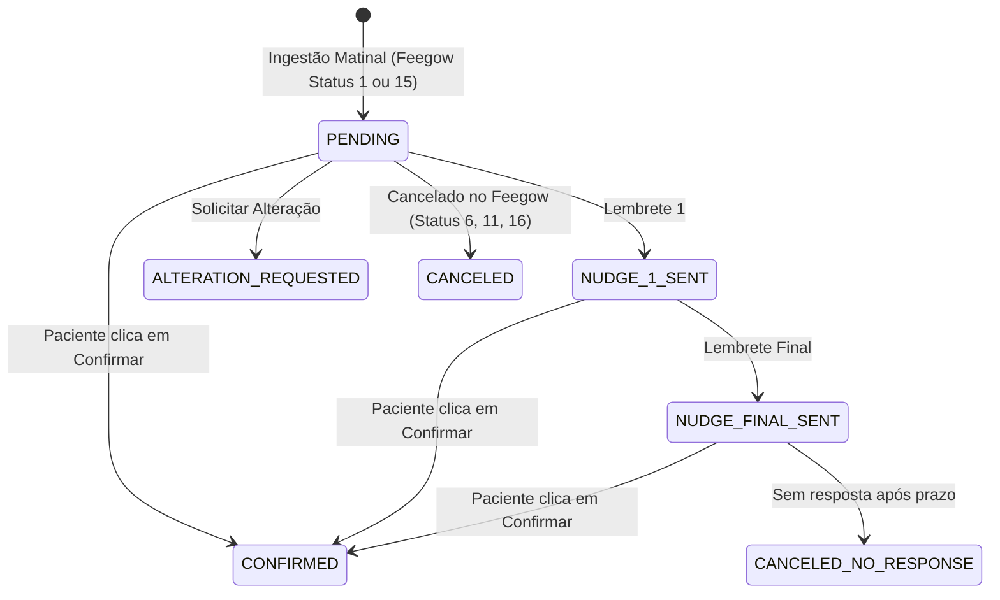

# Catálogo de Funcionalidades e Regras de Negócio — CTRLS ITSM

Este documento especifica formalmente as regras de negócio, algoritmos de automação, fluxos de contingência e diretrizes operacionais de cada módulo do ecossistema CTRLS ITSM.

---

## 1. Motor de Agendamentos e WhatsApp

O motor de agendamentos automatiza a confirmação, o cancelamento, a alteração e o acompanhamento pós-consulta de pacientes da organização integrando o Feegow ERP ao WhatsApp (via Take Blip).

### 1.1 Ingestão e Calendário de Antecedência (D+0 a D+3)
A rotina matinal de ingestão (`IngestAppointmentsUseCase`) é executada automaticamente e segue regras de cálculo de dias de antecedência:
* **Operação em Dias Úteis:** O motor opera de segunda a sexta-feira. Aos sábados e domingos a ingestão geral é ignorada.
* **Segunda a Quinta-Feira:** Consulta os agendamentos de **Hoje (D+0)** e **Amanhã (D+1)**.
* **Sexta-Feira:** Consulta os agendamentos de **Sexta (D+0)**, **Sábado (D+1)** e antecipa as consultas de **Segunda-Feira (D+3)**.
* **Regra D+2 para Médicos com Antecedência Configurada:**
  * Médicos configurados com `advance_notice_days = 2` na tabela `doctor_configurations` (ex: Dermatologia e Biópsias) recebem buscas dedicadas para D+2.
  * **Trava D+2:** As buscas D+2 são executadas exclusivamente às **quartas-feiras** (para pautas de sexta D+2) e às **quintas-feiras** (para pautas de sábado D+2).

### 1.2 Filtro Estrito de Procedimentos (Cirurgias vs Consultas)
Para garantir que procedimentos cirúrgicos complexos não recebam mensagens automáticas indevidas:
* **Bloqueio Cirúrgico:** Qualquer procedimento que contenha a raiz `"cirurg"`, `"cirurgias mu"`, `"cirurgias mar"`, `"cirurgia dr"` é sumariamente descartado da esteira.
* **Exceções Cirúrgicas Permitidas:** Termos explícitos como `"conversar cirurgia"`, `"acertar cirurgia"` e `"retorno"` são aceitos.
* **Procedimentos Ambulatoriais Permitidos:** Consultas, retornos, exames, curativos, avaliações, retirada de pontos/dreno, botox, lobuloplastia, laser CO2, infiltrações, viscossuplementação, bioestimuladores e biópsias são elegíveis.

### 1.3 Máquina de Estados e Blindagem Anti-Cancelamento
As sessões de agendamento seguem o ciclo de vida gerenciado por `ConfirmationStateMachineService`:

* **Blindagem de Sessões Confirmadas:** Registros com status local `CONFIRMED` **nunca** são cancelados automaticamente na ingestão matinal.
* **Reconciliação Preventiva:** Se um agendamento deixar de vir na busca geral de `StatusID = 1`, o sistema consulta o status individual na API do Feegow antes de qualquer alteração:
  * Se o status retornado for de confirmação/presença (`7, 2, 3, 4, 5, 101, 103, 105`), atualiza/mantém como `CONFIRMED`.
  * Se o status for cancelamento explícito (`6` Falta, `11` Desmarcado pelo paciente, `16` Desmarcado pelo profissional), atualiza para `CANCELED`.

### 1.4 Esteira de Lembretes Recorrentes (Nudges) e Tratamento de Respostas
* **Nudges Individuais e de Grupo:** Gerenciados pelo `MonitorAppointmentNudgesUseCase`. Se o paciente não responder ao primeiro template de aviso, o sistema agenda disparos de reforço a cada ciclo (janela configurável de 2 horas).
* **Templates Estáticos de 0 Parâmetros:** Para templates de grupo sem placeholders (ex: `aviso_agendamento_grupo`), o `BlipNotificationService` detecta o formato estático e omite 100% o campo `messageParams` no payload para a API Active Campaign da Take Blip, evitando o erro de validação da Meta (#132000).
* **Cancelamento Seguro sem Exclusão no ERP Feegow:** Quando o paciente solicita cancelamento respondendo ao WhatsApp, o robô encerra a sessão local (para cessar novos lembretes automáticos) e transborda o atendimento para a fila das secretárias no Desk com ticket aberto. **O agendamento permanece intacto na grade do Feegow**, permitindo que a recepção faça contato ativo e remanejamento manual sem risco de perder o histórico.
* **Re-validação Preventiva:** Antes de enviar cada nudge, o sistema consulta a API do Feegow. Se a consulta tiver sido cancelada, remarcada ou confirmada na recepção, o envio é abortado imediatamente.
* **Attendance Guard:** Se houver um ticket de atendimento humano ativo no Blip Desk para o paciente (`hasActiveTicket`), o envio de nudges é pausado para não interromper a conversa com a secretária.

### 1.5 Avaliação Pós-Consulta (Google Review)
* O serviço `SendPostAppointmentReviewUseCase` roda periodicamente consultando agendamentos do dia no Feegow com status `StatusID = 3` (*Atendido*).
* Para cada paciente atendido cujo médico possua uma URL configurada em `doctor_configurations.google_review_url`, o sistema despacha uma mensagem convidando o paciente a avaliar o atendimento no Google Meu Negócio.

### 1.6 Monetização Médica e Licenciamento
* O motor valida a assinatura do profissional (`DoctorBilling/isLicensed`) antes de processar os agendamentos. Pautas de médicos inativos ou suspensos são ignoradas na ingestão.

### 1.7 Acumulador Atômico de Agendamentos em Grupo (`NotificationAccumulatorService`)
* **Agrupamento Familiar / Múltiplos Procedimentos:** Quando um paciente ou responsável possui dois ou mais agendamentos no mesmo dia (ex: irmãos consultando na mesma data ou exames sequenciais), o `NotificationAccumulatorService` consolida as sessões em um único registro em `notification_groups`.
* **Disparo Exclusivo do Template de Grupo:** As sessões vinculadas a um grupo recebem o template consolidado `aviso_agendamento_grupo` e têm sua flag de notificação preenchida.
* **Prevenção de Race Conditions:** O motor bloqueia o envio subsequente de templates individuais avulsos para consultas que já pertençam a um grupo ativo, evitando que mensagens isoladas sejam disparadas minutos depois e confundam o paciente.

### 1.8 Pesquisa de Satisfação e CSAT no WhatsApp
* Os fluxos de pesquisa e avaliação interativa utilizam menus com opções puramente numéricas (`1`, `2`, `3`, `4`, `5`).
* Essa estrutura respeita rigorosamente o limite de caracteres de botões da Meta/WhatsApp e garante compatibilidade com o parser de respostas do backend.

---

## 2. Controle de Acesso Físico e Catracas (Módulo Access)

O módulo `access` integra a confirmação de consultas do Feegow ao sistema de controle de catracas físicas **GerAcesso**, orquestrando a emissão, reativação, auto-cadastro em totem e apresentação mobile de credenciais.

### 2.1 Janelas Dinâmicas de Liberação Física
O serviço `AccessWindowCalculator` calcula as janelas de liberação horária garantindo segurança predial e comodidade:
* **Janela Padrão de Consultas:** Abertura a partir das **06:00** e encerramento às **23:00** do dia da consulta, cobrindo com folga eventuais atrasos ou atendimentos estendidos.
* **Janela de Auto-Cadastro / Totem:** Abertura às **06:00** com encerramento às **23:59** para pacientes que realizam check-in avulso na recepção.
* **Ajuste de Data Efetiva (`resolveAppointmentDate`):** Se a data de agendamento estiver retroativa ou for processada no próprio dia, o cálculo ancora no dia corrente da clínica (`America/Sao_Paulo`).

### 2.2 Portal Web do Paciente & PWA Mobile (`/acesso/:id`)
* **Autenticação 2FA por Telefone:** O paciente digita os 4 últimos dígitos do seu telefone para desbloqueio seguro, com suporte a preenchimento automático por link autenticado (`?t=TOKEN` ou `?p=1234`).
* **Multi-Unidade & White-Label Dinâmico:** O portal detecta automaticamente a rota e query parameters, aplicando temas visuais personalizados via tokens White-Label ou parâmetros de unidade.
* **Carrossel de Credenciais & Acompanhantes:** Apresentação em cartões individuais no padrão Wallet digital. Cada cartão exibe o nome do titular ou acompanhante, status de liberação, médico atendente (`access_credentials.doctor_name`) e botão de expansão.
* **Modo Tela Cheia com Screen Wake Lock:** Ao abrir o QR Code em tela cheia, a Screen Wake Lock API mantém a tela do smartphone acesa com brilho ideal e contraste puro para leitura a 10–15 cm da lente ótica da catraca.
* **Cache Offline Resiliente:** As credenciais validadas são persistidas em `localStorage`. Se o paciente perder sinal de celular na portaria ou no elevador, o app abre instantaneamente e mantém o QR Code visível.
* **Re-renderização Reativa do QR Code:** Chaves exclusivas (`key={cred.credentialCode}`) forçam a renderização instantânea do `<QRCodeCanvas>`, prevenindo que navegadores mobile (Safari iOS / Chrome Android) congelem o canvas visual após trocas de credencial.

### 2.3 Reativação Imediata & Resolução de Anti-Passback (`ReactivateAccessUseCase`)
* **Problema Resolvido:** Se o paciente apresentar o QR Code no leitor da catraca mas hesitar e não empurrar os braços mecânicos a tempo, a controladora aciona a proteção anti-passback ou expira a leitura, bloqueando nova tentativa com a mesma credencial.
* **Ação do Paciente / Recepção:** O paciente simplesmente clica em *"Atualizar QR Code"* no cartão ou modal de tela cheia.
* **Emissão em Tempo Real:** O backend despacha uma nova requisição para a GerAcesso com `inicio_visita` retroativo em 5 minutos (`now.minusMinutes(5)`) para compensar desvios de relógio da máquina física e estendendo até as 23:59.
* **Substituição Transparente:** O GerAcesso retorna um novo código de credencial numérica, que é persistido no banco e atualizado na tela do paciente sem exigir recarregamento da página.

### 2.4 Auto-Cadastro e Totem de Autoatendimento (`SelfRegistrationUseCase`)
* **Fluxo em Totem Touchscreen:** Pacientes que chegam à clínica sem agendamento prévio ou que necessitam de credencial física imediata digitam seu CPF no totem (`/acesso/totem`).
* **Busca Integrada no Feegow:** O `LookupCredentialsByCpfUseCase` localiza as consultas ativas do paciente para o dia.
* **Auto-registro Imediato:** Se o paciente não tiver consulta marcada, o sistema permite o auto-cadastro rápido coletando nome, telefone e médico, emitindo na hora a liberação na catraca física e gravando as colunas `phone` (V53) e `doctor_name` (V54).

### 2.5 Cadastro Concorrente de Acompanhantes (Java 21 Virtual Threads)
* O paciente titular pode cadastrar acompanhantes pelo chatbot do WhatsApp ou diretamente pelo botão *"Adicionar Acompanhante"* no portal web.
* O backend despacha as requisições em **paralelo** utilizando **Java 21 Virtual Threads**, processando cada visitante de forma independente sem gargalo de thread pool.
* **Falha Isolada:** A rejeição de um acompanhante pela catraca não afeta nem bloqueia a liberação do titular e dos demais acompanhantes.

### 2.6 Fallback Síncrono de CPF no WhatsApp
* Se o agendamento no Feegow não possuir o CPF cadastrado, a API notifica o chatbot com a flag `"requiresCpfFallback": true`. O robô do Blip solicita a digitação do CPF antes de gerar o link da catraca física, garantindo a integridade dos registros prediais.

---

## 3. Central de Chamados de Suporte (ITSM)

### 3.1 Cálculo de SLA Útil e Priorização Dinâmica
* O prazo limite de resolução (`sla_deadline`) é calculado somando a quantidade de horas da categoria (`itsm_categories.sla_hours`) considerando **apenas o horário comercial útil** da clínica.
* Finais de semana e noites não consomem o tempo de SLA.

### 3.2 Regra de Parada Crítica (#🚨ParadaCrítica)
Quando um incidente impede o funcionamento de consultórios, exames ou sistemas centrais:
* **Disparo:** Chamado vinculado a ativo crítico (`assets.is_critical = true`) ou com código patrimonial (`INV-\d{4}-\d+`) na descrição.
* **Ações Automáticas:**
  1. A prioridade é promovida para `URGENT`.
  2. O SLA é recalculado para o prazo estrito de **1 hora**.
  3. A tag `#🚨ParadaCrítica` é vinculada ao chamado.
  4. Alerta com embed vermelho e localização física é enviado por DM do Discord aos técnicos e ao canal operacional.

### 3.3 Subchamados e Múltiplas Atribuições
* **Hierarquia (`parent_ticket_id`):** Incidentes complexos podem ser divididos em subchamados menores atribuídos a diferentes especialistas.
* **Atribuições Múltiplas (`ticket_assignments`):** Permite que mais de um técnico atue simultaneamente na resolução do chamado.

---

## 4. Gestão de Ativos e Estoque (CMDB + FIFO)

### 4.1 Dedução de Estoque via Algoritmo FIFO (First-In, First-Out)
* A saída de insumos de TI consome prioritariamente os lotes mais antigos (`stock_batches`) com saldo positivo (`remaining_quantity > 0`).
* **Transacionalidade Obrigatória:** A dedução de estoque ocorre dentro da mesma transação do chamado (`Propagation.MANDATORY`). Se o saldo for insuficiente, a transação inteira sofre rollback.

### 4.2 Alertas de Estoque Mínimo (`min_stock`)
* Quando a retirada faz o saldo total do item atingir ou ficar abaixo de `min_stock`, o evento `LowStockEvent` dispara uma notificação imediata no canal de compras do Discord.

### 4.3 Rastreabilidade Bidirecional de Manutenções (CMDB + ITSM)
* Ordens de serviço registradas em `asset_maintenances` vinculam o ID do chamado de suporte de origem (`ticket_id`), permitindo auditoria contábil dos custos de reparo de cada equipamento.

---

## 5. Cofre de Senhas (Vault) & Auditoria LGPD

### 5.1 Criptografia Simétrica AES-256-GCM e MFA Mandatório
* Dados confidenciais e anexos são cifrados com **AES-256-GCM** com IV aleatório e autenticação de integridade.
* A visualização ou alteração de qualquer segredo exige validação prévia de segundo fator TOTP (claim `two_factor_verified = true`).

### 5.2 Trilha de Auditoria Imutável (`audit_logs`)
* Todas as ações sensíveis (acesso ao cofre, alterações de chamado, liberações de catraca, logins) publicam eventos assíncronos (`AuditEvent`) gravados com IP, data e correlation ID.

---

## 6. Frontend SPA & Experiência do Usuário (React 19 + TypeScript + Vite)

### 6.1 Paginação Dinâmica e Totalizadores de Registros
* **Navegação Precisa:** As listagens de **Chamados** (`/tickets`) e **Inventário** (`/inventory`) calculam e apresentam os totais reais de itens e páginas (`Exibindo X de Y itens — Página A de B`).
* **Suporte a Tamanho Dinâmico:** Os endpoints REST do backend aceitam o parâmetro `size` configurável com limites seguros (`1..1000`), evitando truncamento forçado em 15 registros.

### 6.2 Dropdown Pesquisável Autônomo (`SearchableDropdown`)
* **Catálogo Completo:** Modais de entrada de estoque (`AddBatchModal`), requisição de itens e alocação carregam a totalidade dos itens cadastrados (`getItems({ size: 1000 })`), independentemente da página atual da tabela.
* **Interface Aprimorada:** Altura de rolagem expandida (`max-h-60`) e indicador de contagem de opções disponíveis.

### 6.3 Resiliência Global com Error Boundary
* **Prevenção de Tela Branca:** O componente `ErrorBoundary` intercepta exceções não tratadas durante o ciclo de vida do React e exibe um card amigável de recuperação com opção de recarregar a interface ou retornar ao painel principal.

### 6.4 Metadados Declarativos Nativos do React 19
* Inserção nativa de `<title>` e `<meta name="description">` em todas as páginas da aplicação, fornecendo contexto e acessibilidade ao usuário sem necessidade de bibliotecas de terceiros.

### 6.5 Otimização de Chunks no Build do Vite
* Separação estrita de dependências em chunks isolados via Rollup:
  * `vendor-react` isolado em apenas **231 kB** (redução de 83% no payload inicial).
  * Editor pesado de Markdown (`@uiw/react-md-editor`) isolado em `vendor-editor`, carregado sob demanda apenas nas páginas de chamados.