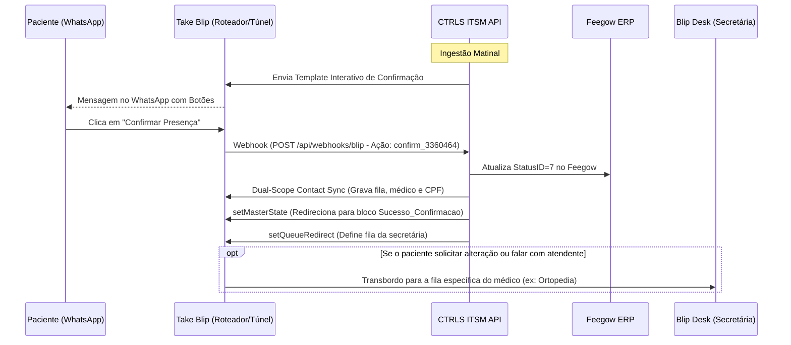
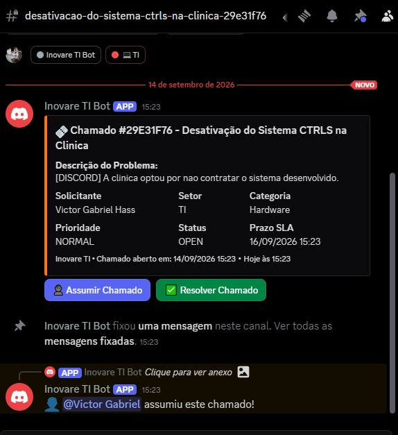

# Manual de Integrações e APIs Externas — CTRLS ITSM

Este documento apresenta os contratos de integração, diagramas de sequência, payloads JSON e fluxos de contingência entre o ecossistema CTRLS ITSM e as plataformas externas parceiras: **Feegow ERP**, **Take Blip (WhatsApp)**, **GerAcesso (Catracas)**, **Conta Azul V2 (Financeiro)** e **Discord (Bot JDA 5)**.

---

## 1. Integração com Feegow ERP (Prontuário & Pautas)

O Feegow ERP é o sistema central de prontuários médicos da clínica. A comunicação é realizada via chamadas HTTPS autenticadas pelo header `x-access-token`.

### 1.1 Tabela Oficial de Status de Agendamento do Feegow

| ID | Status Oficial | Classificação no Sistema | Comportamento no Sistema |
|:---:|:---|:---:|:---|
| **`1`** | **Marcado - não confirmado** | `PENDING` | Elegível para disparo inicial de confirmação e lembretes (nudges). |
| **`7`** | **Marcado - confirmado** | `CONFIRMED` | Confirmado: Preservado, nunca cancelado e sem cobrança de lembrete. |
| **`15`** | **Remarcado** | `PENDING` | Elegível para nova confirmação de data. |
| **`2`** | **Em atendimento** | `CONFIRMED` / Presença | Paciente em consultório. Não cancela / Aborta lembrete. |
| **`3`** | **Atendido** | `CONFIRMED` / Presença | Consulta concluída. Dispara avaliação Google Review pós-atendimento. |
| **`4`** | **Aguardando \| Atendimento** | `CONFIRMED` / Presença | Paciente presente na recepção. Não cancela / Aborta lembrete. |
| **`5`** | **Chamando \| atendimento** | `CONFIRMED` / Presença | Paciente chamado no painel. Não cancela / Aborta lembrete. |
| **`101`** | **Aguardando \| Triagem** | `CONFIRMED` / Presença | Paciente na triagem. Não cancela / Aborta lembrete. |
| **`103`** | **Em atendimento \| Triagem** | `CONFIRMED` / Presença | Paciente em triagem. Não cancela / Aborta lembrete. |
| **`105`** | **Chamando \| Triagem** | `CONFIRMED` / Presença | Paciente sendo chamado para triagem. Não cancela / Aborta lembrete. |
| **`6`** | **Não compareceu** | `CANCELED` (Falta) | Sessão local encerrada como cancelada / Bloqueio de lembretes. |
| **`11`** | **Desmarcado pelo paciente** | `CANCELED` | Sessão local encerrada como cancelada / Bloqueio de lembretes. |
| **`16`** | **Desmarcado pelo profissional** | `CANCELED` | Sessão local encerrada como cancelada / Bloqueio de lembretes. |

### 1.2 Principais Endpoints Consumidos

* **Busca de Agendamentos por Data e Status:**
  ```http
  GET https://api.feegow.com/v1/api/appoints/search?data={YYYY-MM-DD}&status=1&id_profissional={id}
  x-access-token: {{FEEGOW_TOKEN}}
  ```
* **Busca de Agendamento Individual por ID:**
  ```http
  GET https://api.feegow.com/v1/api/appoints/search?agendamento_id={id}
  x-access-token: {{FEEGOW_TOKEN}}
  ```
* **Atualização de Status de Consulta:**
  ```http
  POST https://api.feegow.com/v1/api/appoints/statusUpdate
  Content-Type: application/json
  x-access-token: {{FEEGOW_TOKEN}}

  {
    "AgendamentoID": 3360464,
    "StatusID": 7,
    "Obs": ""
  }
  ```
* **FEEGOW-STATUS-GUARD:** O adaptador impede regressão indevida para status 7 caso o paciente já esteja em estado avançado (`2, 3, 4, 5, 6, 7, 11, 16, 101, 103, 105`).
* **Preservação de Agenda em Cancelamentos:** Ao receber intenção de cancelamento pelo WhatsApp, a API **não chama `/appointment/cancel`**. A consulta permanece intacta na grade da clínica e a conversa é roteada para a recepção no Blip Desk para remanejamento manual seguro.

---

## 2. Integração com Take Blip (WhatsApp Cloud & Blip Desk)

A integração com o Take Blip utiliza a API Active Campaign (`/campaign/full`), comandos LIME e webhooks para automação e transbordo para secretárias.

### 2.0 Suporte a Templates Estáticos (0 Parâmetros - WhatsApp Meta)
* Templates sem variáveis no corpo (ex: `aviso_agendamento_grupo`) são identificados por `isStaticZeroParamTemplate`.
* O backend **omite totalmente o array `messageParams`** no JSON enviado para a Take Blip, cumprindo a validação da Meta e prevenindo erros `Code 81 - #132000`.



### 2.1 Sincronização de Contatos em Duplo Escopo (Dual-Scope Sync)
Para garantir que os dados do paciente e o roteamento de fila estejam disponíveis tanto no bot principal quanto no painel de atendimento humano:
* O serviço `BlipContactClientAdapter` envia o comando LIME `/contacts` de forma síncrona para:
  1. **Roteador Principal:** Utilizando a chave `APP_APPOINTMENT_BLIP_BOT_KEY`.
  2. **Túnel do Blip Desk:** Utilizando a chave `APP_APPOINTMENT_BLIP_DESK_KEY`.
* **Metadados Gravados em `extras`:**
  * `Medico`: Nome do profissional atendente.
  * `fila`: Nome textual sanitizado da fila de destino (ex: `Ortopedia Pediátrica - Dr. Eduardo Mattos`, `Cirurgia Vascular - Dr. Bruno Figueiredo Pançan`).
  * `taxDocument`: CPF formatado do titular.
  * `birthDate`: Data de nascimento do prontuário.

### 2.2 Transbordo Dinâmico por Fila no Blip Desk
* O resolvedor de filas (`BlipContextService.resolveQueueName`) traduz o UUID ou ID do médico para o nome exato da fila cadastrada no Blip Desk.
* O comando `setQueueRedirect` injeta a variável de contexto `attendanceQueueToRedirect` no contato. No fluxo do Blip, o bloco de transbordo humano lê `{{contact.extras.fila}}` para direcionar a conversa à secretária responsável.

### 2.3 Menus Interativos de Avaliação e CSAT (WhatsApp Meta)
* As etapas de avaliação pós-consulta e pesquisa de satisfação utilizam mensagens estruturadas (`select+json` / menus interativos) com opções puramente numéricas (`1` a `5`).
* Essa formatação cumpre a especificação da Meta para limites de caracteres em botões do WhatsApp e garante que as notas sejam capturadas com precisão pelo webhook da API.

---

## 3. Integração com Controle de Catracas Físicas (GerAcesso)

O módulo `access` orquestra a emissão de credenciais físicas e QR Codes para liberação de acesso nas catracas físicas da clínica, integrando o agendamento médico ao servidor local da **GerAcesso**.

### 3.1 Contrato REST da API GerAcesso

* **Endpoint:** `POST {{GERACESSO_URL}}` (padrão local: `http://172.25.100.106:8082/AgendamentoVisita`)
* **Autenticação:** Header HTTP `Authorization: Bearer {{GERACESSO_TOKEN}}` (com prefixação defensiva automática `Bearer ` caso a variável não a contenha).
* **Timeouts de Rede:** 10 segundos de `connectTimeout` e 10 segundos de `readTimeout` configurados no `JdkClientHttpRequestFactory`.

#### Payload de Requisição (`GerAcessoRequest`):
```json
{
  "cpf": "12251091831",
  "status": 1,
  "nome": "SILVANA CRISTINA CARDOSO",
  "telefone": "42999998888",
  "email": "",
  "tipovisista": 1,
  "matricula_visitado": "0045",
  "cpf_visitado": "12345678901",
  "inicio_visita": "24/08/2026 07:55",
  "fim_visita": "24/08/2026 23:59"
}
```

> [!IMPORTANT]
> **Campo Mandatório `tipovisista: 1`:** A controladora da GerAcesso exige rigorosamente o campo com a grafia exata `"tipovisista"` preenchido com o valor inteiro `1`. Se esse parâmetro for omitido ou enviado com grafia corrigida (`tipoVisita`), a catraca não libera o acesso. O record `GerAcessoRequest` força internamente `visitType = 1` no seu construtor canônico.

* **Detalhamento dos Campos:**
  * `cpf`: CPF limpo (somente dígitos). Mascarado nos logs da aplicação (`***.510.***-31`) para conformidade LGPD.
  * `status`: Inteiro `1` (agendamento ativo).
  * `nome`: Nome completo do paciente ou acompanhante.
  * `telefone`: Telefone/WhatsApp com DDD (apenas dígitos).
  * `email`: E-mail de contato (opcional/vazio).
  * `matricula_visitado`: Matrícula do médico cadastrada em `doctor_configurations.ger_acesso_matricula`.
  * `cpf_visitado`: CPF do profissional atendente cadastrado em `doctor_configurations.ger_acesso_cpf`.
  * `inicio_visita` e `fim_visita`: Janela física no formato `dd/MM/yyyy HH:mm` (`AccessWindowCalculator.GERACESSO_DATE_FORMATTER`).

#### Payload de Resposta (`GerAcessoResponse`):
```json
{
  "status": "1",
  "mensagem": "Visita agendada com sucesso.",
  "agendamento": 104592,
  "tipo": "Visitante",
  "pessoa": 8520,
  "localizador": "LOC-849201",
  "credencial": "9283741"
}
```

* **Mapeamento:**
  * `credencial`: Código numérico gerado pela controladora da catraca física. Este valor é codificado no QR Code apresentado no leitor ótico.
  * `localizador`: Código alfanumérico para auditoria visual na tela da recepção.

### 3.2 Resiliência de Rede e Mecanismo de Auto-Retry

Para absorver micro-instabilidades na rede local do servidor GerAcesso ou pequenos delays da controladora:
* O `GerAcessoRestClientAdapter` executa até **2 tentativas** de envio HTTP POST.
* Se a primeira tentativa falhar (ex: `SocketTimeout`, `ConnectException` ou status HTTP não-2xx), o adapter aguarda um backoff de **800ms** antes do retry imediato.
* Falhas e respostas anômalas registram o payload mascarado e o corpo retornado em nível `ERROR`/`WARN` nos logs de auditoria.

### 3.3 Motor de Reativação Dinâmica de Acesso (`ReactivateAccessUseCase`)

* **Endpoint:** `POST /api/v1/access/reactivate/{appointmentId}` (aceita ID Feegow, prefixo de totem `INOV-...` / `IMG-...` ou fallback por CPF).
* **Solução para Anti-Passback e Travamento de Catraca:** Se o leitor ótico da catraca fizer a leitura do QR Code mas o paciente hesitar ou não girar o braço dentro do tempo de timeout do hardware (disparando a proteção anti-passback da controladora), a credencial anterior é rejeitada pela catraca.
* **Janela Imediata:** O use case calcula `startVisit = now.minusMinutes(5)` e `endVisit = 23:59` do dia corrente. A margem de 5 minutos retroativos compensa eventuais descompassos de relógio (clock skew) entre a VM do backend e a controladora física.
* **Resolução Médica:** Identifica o profissional atendente por ID Feegow ou pelo nome salvo na credencial (`access_credentials.doctor_name` via migração V54), emitindo um novo registro de visita no GerAcesso com novo código de credencial.
* **Atualização Atômica:** O banco de dados é atualizado com a nova credencial mantendo a rastreabilidade original.

### 3.4 Cadastro Concorrente de Acompanhantes (Java 21 Virtual Threads)

* Pacientes com acompanhantes (idosos, crianças, PCDs) têm seus acompanhantes cadastrados em **paralelo** via **Java 21 Virtual Threads** (`Executors.newVirtualThreadPerTaskExecutor()`).
* **Isolamento de Falhas:** O cadastro de cada acompanhante opera em bloco `try-catch` isolado. Se a controladora recusar um acompanhante secundário, o titular e demais acompanhantes são liberados sem interrupção.

### 3.5 Arquitetura de Cache Offline PWA no Frontend

* **Armazenamento Local Escopado:** O frontend grava as credenciais validadas no `localStorage` sob a chave `patient_access_{clinicId}_last_credentials`.
* **Disponibilidade na Recepção/Elevador:** Se o paciente perder sinal de rede móvel (4G/5G) ou Wi-Fi ao entrar na clínica, o aplicativo PWA carrega instantaneamente as credenciais do cache local, exibindo o QR Code em tela cheia com alta legibilidade.
* **Prevenção de Congelamento de Canvas:** Os componentes `CredentialCard` e `FullscreenQrModal` utilizam chaves dinâmicas (`key={cred.credentialCode}`) para forçar a re-renderização imediata do `<QRCodeCanvas>` do React, eliminando travamentos de renderização no motor WebKit/Blink mobile após atualizações de credenciais.

---

## 4. Integração Financeira (Conta Azul V2)

Automação de conciliação de faturamentos quitados (`ACQUITTED`) e emissão de recibos fiscais.

### 4.1 Ciclo de Vida OAuth2 e Renovação Proativa
* **Fluxo de Autorização:** Consentimento via URL gerada com `client_id`, `redirect_uri` e `state` UUID.
* **Troca de Authorization Code:** Troca síncrona no endpoint `/callback`, gravando `access_token` e `refresh_token` na tabela `contaazul_oauth_tokens`.
* **Proatividade e Concorrência:** Um job periódico a cada 50 minutos valida se a expiração está a menos de 5 minutos. Uma trava `ReentrantLock` impede que múltiplas threads disparem renovações duplicadas.
* **Purga Automática:** Se a API retornar `invalid_grant`, todos os tokens locais são purgados e o painel exibe aviso para nova autorização manual.

### 4.2 Rate Limiting e Pacing
* **Rate Limiting Distribuído:** O endpoint `/force-refresh` é protegido pelo `RedisRateLimiter` (limite de 3 requisições por minuto por usuário/IP), com fallback síncrono em memória (`ConcurrentHashMap`).
* **Pacing no Loop de Vendas:** Pausa controlada de **350ms** (`LockSupport.parkNanos`) entre cada venda processada.
* **Emissão de Contingência (OpenPDF):** Se o download do recibo oficial falhar, o serviço `InternalReceiptEmissionService` gera um PDF interno padronizado com layout institucional corporativo.

---

## 5. Integração com Discord (Bot JDA 5)

Roteamento de incidentes e operações de suporte em tempo real com orquestração de canais dinâmicos e botões reativos.

### 5.1 Slash Commands Administrativos e Operacionais
* `/ti status`: Exibe embed rico com status da JVM, memória, banco de dados, filas e conexões de rede. Restrito aos IDs de administradores configurados em `discord.bot.admin-ids`.
* `/solicitar`: Interface para colaboradores solicitarem insumos de hardware com autocomplete em tempo real.
* `/chamado`: Abertura ágil de incidentes e solicitações de TI diretamente pelo Discord.
* `/meuschamados`: Consulta rápida de chamados em andamento atribuídos ao solicitante logado.
* `/vincular`: Associação de segurança entre a conta Discord e o usuário institucional.
* `/ajuda`: Consulta instantânea de artigos da Base de Conhecimento e FAQ da TI.


*Menu interativo de Slash Commands com autocomplete suportado pelo bot institucional.*

### 5.2 Botões Interativos de Ação e Ciclo de Vida do Chamado
* **Abertura de Chamado:** Notificação em embed rico no canal de alertas da equipe técnica (`#alertas-ti`), informando identificador único, solicitante, setor e nível de prioridade.
* **Criação Automática de Canal Exclusivo:** Para cada chamado aberto, o bot cria dinamicamente um canal dedicado de atendimento (`#nome-do-chamado-{id}`) garantindo comunicação isolada e sem ruídos entre solicitante e time de TI.
* **Ações por Botões Interativos:**
  * `ticket_accept:{ticketId}` (*Assumir Chamado*): Vincula o técnico responsável no banco relacional PostgreSQL, fixa a mensagem no canal e notifica a equipe.
  * `ticket_resolve:{ticketId}` (*Resolver Chamado*): Permite registrar o parecer técnico de solução diretamente pelo Discord, encerrando o ciclo de SLA.
  * `ticket_reopen:{ticketId}` (*Reabrir Chamado*): Disponível após o encerramento caso o solicitante necessite de suporte complementar.
* **Virtual Threads:** Todas as interações do bot são executadas sob o `discordExecutor` para não bloquear a thread de heartbeat do WebSocket do Discord.


*Embed rico despachado no momento da abertura do chamado pelo comando `/chamado`.*


*Canal criado dinamicamente para o chamado com botões para assumir e resolver o atendimento.*


*Encerramento do chamado com parecer técnico registrado e opção de reabertura.*

