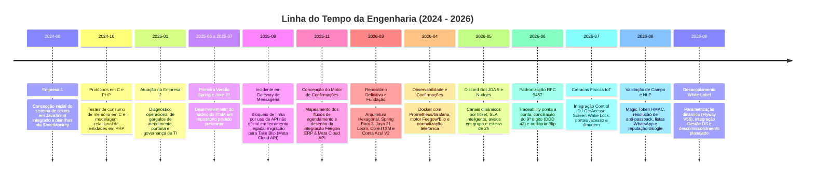
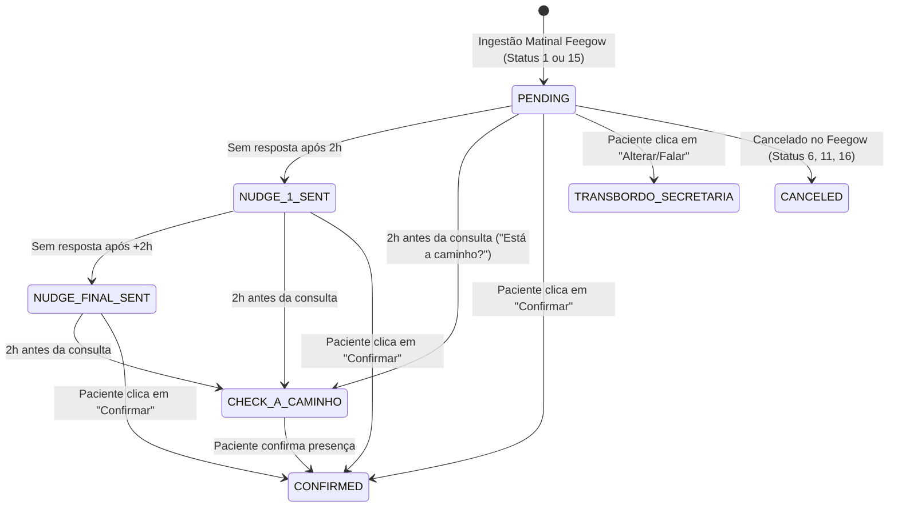
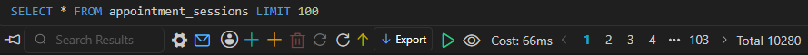
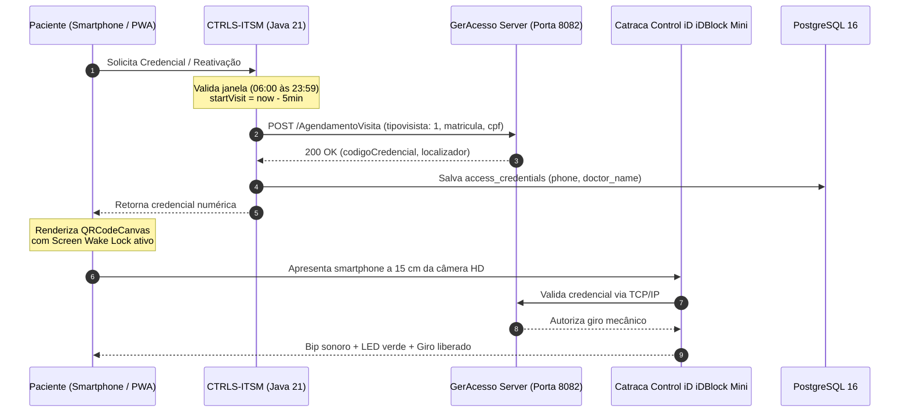
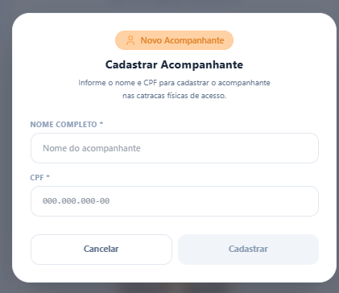
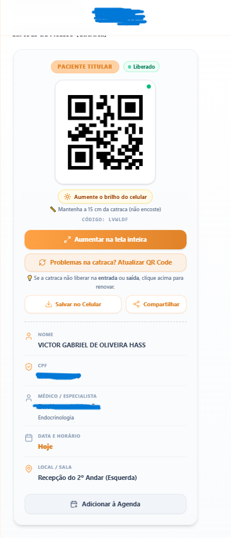
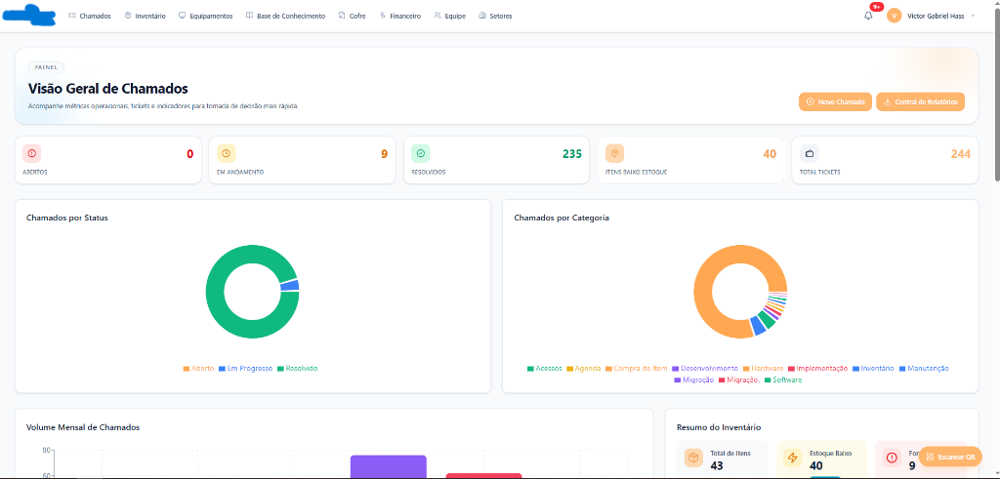
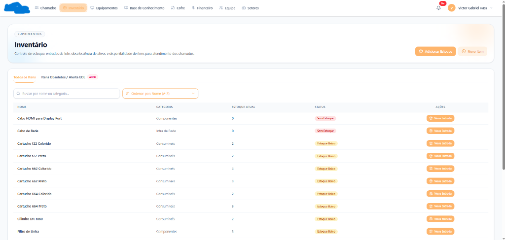
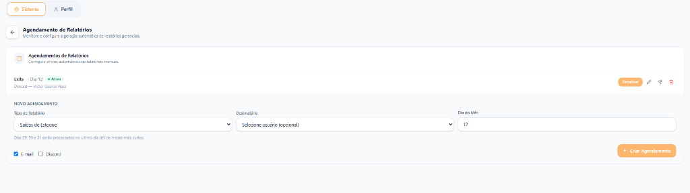

# CTRLS-ITSM: Relatório Técnico de Engenharia e Post-Mortem de Projeto

**Documento:** Relatório Técnico de Desenvolvimento e Post-Mortem de Engenharia  
**Autor:** Victor Gabriel Hass  
**Finalidade:** Portfólio de Engenharia de Software / Trabalho de Conclusão de Curso (TCC)  
**Período:** Agosto de 2024 a Setembro de 2026  
**Stack Principal:** Java 21 (Virtual Threads / Loom), Spring Boot 3 (Arquitetura Hexagonal), PostgreSQL 16, Redis, React 19, TypeScript, Vite, TailwindCSS, Docker, Take Blip (LIME Protocol), Feegow ERP API, Conta Azul V2 API, Control iD iDBlock Mini (GerAcesso), Discord JDA 5.  
**Situação:** Ciclo de validação em produção concluído. Descomissionamento planejado e arquivamento executados ao término da fase de homologação operacional.

---

## 1. Visão Geral

Este documento reúne os detalhes técnicos, a arquitetura e o histórico de desenvolvimento do **CTRLS-ITSM**. O sistema foi concebido e implementado como uma solução integrada de engenharia de software para a **Empresa 2** (e sua unidade parceira de diagnóstico por imagem), com o objetivo de solucionar gargalos críticos de concorrência, automação de agendamentos, controle de acesso físico predial e governança de infraestrutura de TI.

A plataforma unificou cinco frentes de engenharia:
1. **Confirmação Automática de Consultas (WhatsApp + Feegow ERP):** Esteira de mensageria assíncrona conectando a API do Feegow ERP à Meta WhatsApp Cloud API (via Take Blip). O motor implementa lógica de tolerância a falhas, regras especializadas por especialidade médica (como adiantamento programado de horário e calendários de antecedência) e eliminou o gargalo manual no fluxo de confirmação. Foram mais de **11.000 mensagens disparadas em 2 meses** de operação, com picos de vazão de **quase 500 mensagens despachadas em menos de 1 minuto**.
2. **Controle de Acesso Físico IoT (Control iD / GerAcesso):** Integração TCP/IP e REST com catracas eletrônicas na rede local. Os visitantes recebem credenciais dinâmicas em formato de QR Code em aplicação web progressiva (PWA) e efetuam a liberação autônoma no leitor ótico, eliminando filas e triagens manuais na recepção predial. Foram emitidas **mais de 1.800 credenciais de acesso liberadas automaticamente em 2 semanas** de operação contínua nas catracas físicas.
3. **Marketing de Reputação e Telemetria:** Serviço de escuta pós-consulta que identifica atendimentos concluídos no ERP e despacha links de avaliação no Google Meu Negócio, direcionando dinamicamente para o perfil verificado do profissional ou para o perfil institucional da instituição. Em **menos de 30 dias**, a nota média pública no Google saltou de **3.3 para 3.8 estrelas**.
4. **Conciliação Financeira (Conta Azul V2):** Orquestração assíncrona de baixas de honorários, renovação preventiva de tokens OAuth2 e emissão de contingência de recibos em PDF via OpenPDF.
5. **ITSM e Governança Operacional (Discord JDA 5):** Central de incidentes com cálculo de SLA dinâmico ancorado em horas úteis comerciais, almoxarifado de insumos com dedução transacional FIFO e bot reativo no Discord para triagem e atendimento remoto.

---

## 2. Linha do Tempo e Histórico do Projeto (2024 – 2026)

Resumo das principais fases de evolução e engenharia:



### 2.1 Fase Inicial (Agosto a Dezembro de 2024 — Empresa 1)
O primeiro embrião do módulo de suporte começou em agosto de 2024 na **Empresa 1**. O objetivo era aposentar formulários físicos em papel e agilizar o fluxo de chamados de manutenção. A primeira versão foi escrita em JavaScript, salvando dados em planilhas através da API do SheetMonkey.

Posteriormente, foram executados experimentos em C para avaliar alocação de memória e latência sob carga, seguidos por protótipos de modelagem em PHP. Essa etapa forneceu os fundamentos práticos para o ciclo de vida de tickets, matrizes de prioridade e controle de insumos.

### 2.2 Diagnóstico Operacional, Primeiro Protótipo e Resiliência em Mensageria (2025)
Em janeiro de 2025, ao assumir a sustentação e infraestrutura de TI na **Empresa 2** (que operava integrada a uma unidade de diagnóstico por imagem no mesmo complexo), foram diagnosticados três pontos críticos de estrangulamento operacional:

1. **Sobrecarga no Atendimento:** Centenas de contatos telefônicos e disparos manuais de mensagens ocorriam diariamente para confirmação de presenças do dia seguinte, comprometendo a capacidade de acolhimento presencial na recepção;
2. **Gargalo no Acesso Físico Predial:** A recepção do térreo precisava atender telefonemas, responder canais digitais e efetuar cadastros manuais de crachás físicos para catracas, gerando filas contínuas no saguão;
3. **Falta de Governança de TI:** Requisições de suporte e movimentações de insumos de hardware careciam de rastreabilidade centralizada de prazos e controle contábil.

Entre **junho e julho de 2025**, deu-se início à programação da **primeira etapa do ITSM** utilizando **Spring Boot e Java 21** em um repositório preliminar privado. Esse ambiente serviu como laboratório para validar a modelagem de entidades, regras de chamados e controle de estoque de informática. Posteriormente, o repositório foi arquivado para permitir o recomeço com uma arquitetura mais limpa e moderna.

Em **agosto de 2025**, a **Empresa 2** enfrentou uma interrupção crítica em seu canal de comunicação digital: a ferramenta de mensageria intermediária legada teve o número oficial corporativo suspenso pela Meta em razão de conexões não oficiais. A organização realizou a migração emergencial para a plataforma da **Take Blip**, operando através da Meta WhatsApp Cloud API oficial.

Em **novembro de 2025**, com a API oficial da Take Blip homologada, iniciou-se o projeto técnico da automação definitiva: integrar a API da Take Blip diretamente aos endpoints do Feegow ERP, viabilizando o processamento matinal automático das pautas e liberando a equipe de atendimento das rotinas manuais repetitivas.

### 2.3 Evolução Mensal da Engenharia (Março a Setembro de 2026)
Em março de 2026, o desenvolvimento foi reiniciado a partir do zero no repositório definitivo (`CTRLS-ITSM`). A arquitetura foi estruturada sob os princípios de **Arquitetura Hexagonal (Ports & Adapters)** em **Java 21**, aproveitando o suporte nativo a **Virtual Threads (Project Loom)** para sustentação de alta concorrência de I/O em rede com APIs parceiras. O frontend foi desenvolvido em **React 19 / TypeScript** com empacotamento otimizado via Vite.

Abaixo está o resumo dos ciclos mensais de engenharia executados ao longo de 7 meses:

#### Março de 2026: Estrutura inicial, chamados (ITSM) e financeiro
* **Arquitetura Hexagonal:** Isolamento rígido dos contextos de chamados (`ticket`), ativos (`asset`), estoque de TI (`inventory`) e conciliação financeira (`finance`), desacoplando regras de domínio de bibliotecas de infraestrutura.
* **Cálculo de SLA Útil:** Algoritmo que calcula prazos computando exclusivamente a janela de expediente comercial útil da **Empresa 2**, introduzindo a regra `#🚨ParadaCrítica` para priorização automática de incidentes em consultórios.
* **Estoque FIFO:** Controle transacional de insumos de informática garantindo dedução estrita por ordem de chegada de lotes (`Propagation.MANDATORY`).
* **Base de Conhecimento (Ticket Deflection):** Módulo de artigos e FAQ técnico para auto-resolução de dúvidas operacionais.
* **Integração Financeira Conta Azul V2:** Renovação preemptiva de tokens OAuth2 a cada 50 minutos protegida por `ReentrantLock`, autenticação em dois fatores (2FA/TOTP), motor de geração de recibos médicos em OpenPDF para contingência de API e limitador de taxa distribuído em Redis (350ms).
* **Agendamento Multicanal:** Rotinas assíncronas para despacho automatizado de relatórios gerenciais por E-mail e Discord.

#### Abril de 2026: Observabilidade, início das confirmações e recibos
* **Stack de Observabilidade:** Orquestração completa de contêineres Docker com Prometheus, Grafana e Alertmanager para monitoramento de latência e consumo de threads da JVM.
* **Recibos Internos:** Módulo de busca dinâmica de prestadores por CPF/CNPJ para geração e download de recibos com assinatura digitalizada.
* **Início do Motor de Confirmações:** Construção dos adaptadores de integração com o Feegow ERP (`FeegowClient`) e com a Take Blip via protocolo LIME.
* **Normalização Telefônica Rigorosa:** Tratamento sistemático de inconsistências de números brasileiros (validação de DDI 55, DDDs e inserção programática do nono dígito no formato E.164).
* **Máquina de Estados de Agendamento:** Criação da tabela `appointment_sessions` e controle transacional de estados (`PENDING`, `CONFIRMED`, `CANCELED`).

#### Maio de 2026: Bot no Discord, avisos agrupados e esteira de lembretes
* **Bot de Suporte no Discord (JDA 5):** Implementação de Slash Commands com autocomplete (`/chamado`, `/solicitar`, `/ti status`, `/meuschamados`, etc.) para abertura e acompanhamento de tickets via mobile.
* **Canais Dinâmicos e Ações Interativas:** Geração automática de canal de texto exclusivo para cada ticket (`#nome-chamado-hexId`), com botões interativos (`Assumir Chamado`, `Resolver Chamado`) e alerta de proximidade de SLA (< 30 min).
* **Tratamento do Erro Meta #132000:** Ajuste na serialização de templates para pacientes com múltiplos agendamentos no mesmo dia (`aviso_agendamento_grupo`), omitindo parâmetros vazios no payload para cumprir a validação da Meta.
* **Esteira de Lembretes Recorrentes (Nudges):** Implementação do `MonitorAppointmentNudgesUseCase` (reforço automático a cada 2 horas para pacientes não responsivos) e do disparo preventivo *"Você já está a caminho?"* 2 horas antes da consulta.

#### Junho de 2026: Padronização de erros, telefone do Paraná e logs de entrega
* **Padronização RFC 9457:** Adoção universal de `ProblemDetail` com injeção de `traceId` único correlacionando logs do Spring Boot aos interceptores do Axios no React 19.
* **Reconciliação do 9º Dígito no Paraná:** Algoritmo de resolução para divergências em bases de operadoras no DDD 42, prevenindo falhas de entrega em números locais.
* **Auditoria de Falhas de Entrega:** Criação da entidade `BlipDeliveryFailureEntity`, registrando códigos de erro da Meta, motivos de falha de entrega e acionando tentativas de reenvio.
* **Blindagem de Pool de Conexões:** Eliminação de vazamento de conexões no HikariCP através da desativação do *Open Session In View* (`spring.jpa.open-in-view=false`).

#### Julho de 2026: Catracas físicas, portais web e Screen Wake Lock
* **Integração Física com Catracas Control iD:** Conexão com o servidor middleware GerAcesso (`http://catraca.empresa.local:8082/AgendamentoVisita`) que comanda as catracas *iDBlock Mini* no condomínio.
* **Alinhamento Técnico com a Fabricante:** Mapeamento do endpoint `/AgendamentoVisita` e análise de tráfego de rede para validação dos protocolos de liberação.
* **Ajuste de Firmware da Fabricante:** Identificação de que o firmware exigia rigorosamente a grafia tipográfica `"tipovisista": 1` para registrar visitas.
* **Compensação de Clock Skew:** Implementação de janela temporal retroativa de 5 minutos (`now.minusMinutes(5)`) para absorver diferenças de horário entre servidores e catracas.
* **Dois Portais Web Responsivos:** Portal `/acesso/:id` (identidade laranja para consultas gerais) e portal `/imagem` (identidade rosa/magenta `#B8004B` com cache offline em `localStorage` para a unidade parceira de diagnóstico por imagem).
* **Screen Wake Lock API:** Implementação da API nativa nos navegadores mobile para impedir o desligamento da tela enquanto o visitante aguarda na fila da catraca.

#### Agosto de 2026: Validação de campo no saguão, Magic Token e Google Reviews
* **Validação Presencial de Campo:** Acompanhamento técnico presencial no saguão predial observando o comportamento real de leitura ótica nas catracas e ajustando atritos de UX.
* **Magic Token HMAC:** Autenticação criptográfica sem atrito, permitindo ao paciente abrir seu QR Code a partir do link do WhatsApp sem exigir telas de login ou senhas.
* **Resolução Instantânea de Anti-Passback:** Criação do botão *"Atualizar / Reativar QR Code"* com chamada atômica ao `ReactivateAccessUseCase`, gerando nova credencial em milissegundos para casos de hesitação na passagem física.
* **Abas para Acompanhantes:** Interface segmentada para titulares e acompanhantes, com opção de salvar o passe na galeria de fotos do celular e compartilhar via WhatsApp.
* **Listas Nativas no WhatsApp e Blip Flow V2:** Menus interativos (`application/json`) e NLP ponderado priorizando nomes de profissionais e especialidades.
* **Otimização de Índices no PostgreSQL (V49):** Migração Flyway adicionando índices B-Tree em todas as chaves estrangeiras com alto volume de busca.
* **Motor de Avaliações Google:** Disparo automático pós-atendimento (Status 3 Feegow) com encurtador interno e contagem de cliques, elevando a nota da instituição no Google de 3.3 para 3.8 estrelas em menos de um mês.

#### Setembro de 2026: Arquitetura White-Label, Gestão DS e Descomissionamento
* **Módulo de Integração Gestão DS:** Adaptação da ingestão de consultas para interoperabilidade com o software médico Gestão DS.
* **Arquitetura White-Label Dinâmica (Flyway V56):** Desacoplamento total de identidades visuais via tabela `system_settings` e React Context, permitindo reconfigurar paletas, logotipos e nomes em tempo de execução.
* **Consolidação Documental:** Organização sistemática dos manuais de arquitetura, guias de deploy, especificações de integração e este relatório post-mortem.
* **Descomissionamento Planejado:** Encerramento seguro das instâncias nos servidores locais, expurgação e arquivamento de dados em conformidade com as diretrizes de governança e LGPD após a conclusão da fase de validação operacional.

---

## 3. Estrutura de Módulos no Backend

O backend foi organizado em Arquitetura Hexagonal, dividindo o sistema em contextos delimitados desacoplados. As integrações com sistemas externos (Feegow, Blip, Conta Azul, GerAcesso) ficam restritas aos adaptadores de saída (`infrastructure.adapter.output`), de modo que alterações contratuais de terceiros não afetem o domínio de negócio:

```
br.dev.ctrls.itsm.modules/
├── access/         <-- Catracas Control iD, QR Codes dinâmicos, PWA e acompanhantes
├── appointment/    <-- Ingestão Feegow, confirmações no WhatsApp, nudges 2h e Google Review
├── finance/        <-- Conta Azul V2, conciliação e recibos OpenPDF
├── notification/   <-- Bot do Discord (JDA 5), comandos de barra e alertas de TI
├── ticket/         <-- Chamados ITSM, cálculo de SLA em horário comercial e Parada Crítica
├── asset/          <-- Inventário patrimonial (CMDB)
├── inventory/      <-- Estoque de insumos de informática e consumo FIFO
├── vault/          <-- Cofre de senhas criptografado (AES-256-GCM) e 2FA/TOTP
├── audit/          <-- Trilha de auditoria LGPD com Correlation IDs
├── settings/       <-- Configurações gerais e motor White-Label dinâmico (V56)
├── user/           <-- Usuários, perfis de acesso (RBAC) e setores
└── ...             <-- Módulos auxiliares: auth, analytics, communication, etc.
```

---

## 4. Desafios Técnicos e Soluções Implementadas

### 4.1 Automação de Confirmações no WhatsApp (Take Blip & Feegow ERP)

#### Análise de Custo de Engenharia vs. Soluções SaaS Proprietárias:
Durante o desenho da esteira de mensageria, foram avaliadas soluções de mercado para automação de WhatsApp. Propostas de plataformas proprietárias orçavam custos de implantação entre **R$ 18.000,00 e R$ 33.000,00**, acrescidos de taxas recorrentes mensais de suporte (**R$ 2.000,00/mês**), para fluxos genéricos que não suportavam regras de negócio customizadas por especialidade médica nem integração direta e transacional com o Feegow ERP.

Optou-se pela **engenharia interna de uma solução sob medida**, permitindo controle absoluto sobre a máquina de estados, desacoplamento hexagonal e custo de sustentação marginal (dimensionado em cerca de **R$ 80,00 por profissional ativo/mês**), sem royalties proprietários ou dependência de fornecedores externos.

#### Regras específicas por especialidade médica:
Ao invés de um fluxo genérico e rígido, o motor programou regras especializadas mapeadas diretamente no Feegow:

1. **Adiantamento Programado de Horário (10 minutos):**
   * Determinados consultórios enfrentavam atrasos sistemáticos porque pacientes chegavam exatamente no minuto agendado, comprometendo o tempo de triagem.
   * O sistema adiantava em 10 minutos o horário informado na mensagem de confirmação (ex: consulta marcada às 14h00 no ERP era comunicada ao paciente como 13h50). Isso garantiu a presença prévia necessária para recepção e triagem.
2. **Confirmação D+2 para Procedimentos Especiais:**
   * Atendimentos dermatológicos e biópsias exigiam preparo prévio e aquisição de medicações, necessitando de confirmação com 2 dias de antecedência (D+2).
   * O motor despachava essas mensagens exclusivamente às quartas-feiras (para pautas de sexta) e quintas-feiras (para pautas de sábado).
3. **Lembretes Recorrentes (Nudges) a cada 2 Horas:**
   * Se o paciente visualizasse a notificação e não interagisse, o `MonitorAppointmentNudgesUseCase` despachava lembretes automáticos espaçados em 2 horas.
4. **Checagem Preventiva de Proximidade (2 Horas Antes da Consulta):**
   * Exatamente 2 horas antes do horário marcado, o sistema enviava uma pergunta amigável: *"Você já está a caminho?"*. A rotina reduziu faltas de última hora e permitiu o remanejamento proativo de horários na grade.
5. **Métricas de Performance em Produção:**
   * O sistema **reduziu comprovadamente as taxas de absenteísmo (no-show)** e eliminou a sobrecarga de ligações manuais.
   * **Mais de 11.000 mensagens processadas em 2 meses de produção.**
   * **Vazão de pico de quase 500 mensagens em menos de 1 minuto:** Viabilizada pela arquitetura assíncrona em **Java 21 com Virtual Threads**, processando I/O intensivo com a Take Blip e Feegow sem bloqueios de threads de sistema operacional.




*Figura 1: Painel administrativo do motor de confirmações em produção: 68 profissionais mapeados no Feegow ERP, 46 ativos recebendo automações, status do motor em tempo real e opção de disparo manual com data alvo.*


*Figura 2: Registro de auditoria no PostgreSQL: consulta à tabela `appointment_sessions` comprovando 10.280 sessões de confirmação processadas pelo motor.*

#### Resolução de Desafios Críticos no WhatsApp:
1. **Transbordo Dinâmico por Fila no Blip Desk:**
   * *Problema:* Quando o paciente solicitava alteração de consulta ou contato humano, a mensagem caía inicialmente na fila geral de triagem, sobrecarregando uma única atendente.
   * *Solução:* O `BlipContactClientAdapter` implementou sincronização em duplo escopo: enviando o comando LIME `/contacts` simultaneamente para o Roteador Principal e para o Túnel do Desk, injetando o nome do médico e o setor correspondente. O atendimento caía diretamente na fila da equipe responsável pelo consultório.
2. **Erro #132000 da Meta em Templates de Múltiplos Procedimentos:**
   * *Problema:* Disparos para pacientes com mais de um atendimento no mesmo dia (`aviso_agendamento_grupo`) falhavam na API da Meta com `Validation failed (#132000)`.
   * *Solução:* A Meta rejeita o campo `messageParams` quando o template é puramente estático. O adaptador foi calibrado para omitir completamente o nó JSON quando nulo.
3. **Trava de Integridade Contra Regressão de Status:**
   * Agendamentos confirmados pelo paciente no WhatsApp recebiam flag de imutabilidade local para impedir que sincronizações posteriores do ERP regredissem o estado para não confirmado.

---

### 4.2 Controle de Acesso Físico IoT e Catracas Prediais (Control iD / GerAcesso)

#### Resolução de Gargalo de Fluxo Físico no Saguão:
Com as confirmações no WhatsApp estabilizadas, o maior gargalo operacional concentrava-se no saguão de entrada do condomínio. A recepção precisava atender telefonemas, responder canais digitais e efetuar cadastros manuais de crachás plásticos RFID para liberar as catracas prediais. O resultado eram filas diárias de espera.

A solução integrou o agendamento médico ao controle de acesso físico: ao confirmar a consulta no WhatsApp ou realizar o pré-cadastro pelo smartphone, o paciente recebia um QR Code digital dinâmico. Ao chegar ao complexo, aproximava o celular do leitor ótico da catraca eletrônica *Control iD iDBlock Mini* e passava de forma autônoma. Durante as **duas semanas de operação contínua nas catracas**, foram geradas **mais de 1.800 credenciais digitais de acesso**, erradicando as filas no saguão predial.

#### Alinhamento Técnico com a GerAcesso e Testes Locais:
* Foram realizadas reuniões técnicas de alinhamento com a equipe de engenharia da GerAcesso (responsável pelo software intermediário que gerenciava as catracas eletrônicas no condomínio).
* Foram analisados os pacotes TCP/IP de rede, mapeados os contratos REST (`/AgendamentoVisita`) e parametrizadas as regras de tolerância a falhas e anti-passback.
* Foram executados testes exaustivos na rede interna (`http://catraca.empresa.local:8082/AgendamentoVisita`) até a homologação estável para operação real.



#### Testes de Campo no Saguão e Refinamentos de UX:
Durante a operação piloto em produção, o acompanhamento presencial no saguão permitiu identificar e corrigir desafios práticos de engenharia e interação humano-computador:
1. **Tratamento de Payload com Grafia Exigida pelo Firmware (`tipovisista: 1`):**
   * A controladora recusava requisições que enviavam a chave com a grafia gramaticalmente correta `tipoVisita`. A análise de pacotes revelou que o firmware esperava rigorosamente a grafia incorreta `"tipovisista": 1` (commit `2aa38909`).
2. **Hesitação na Passagem e Resolução Imediata de Anti-Passback:**
   * Quando o paciente aproximava o smartphone, a catraca autorizava o giro; contudo, caso hesitasse antes de empurrar o braço mecânico, o leitor bloqueava a credencial por timeout e anti-passback.
   * *Solução:* Foi introduzido o botão *"Atualizar / Reativar QR Code"* no cartão digital (`db58ec73`), disparando o `ReactivateAccessUseCase` com retroatividade de 5 minutos (`now.minusMinutes(5)`) para compensar eventuais divergências de clock (*clock skew*), gerando uma nova credencial válida em milissegundos sem recarregar a página.
3. **Ergonomia Ótica e Compatibilidade Mobile:**
   * Distância focal: adicionada ilustração orientando a distância focal ideal de aproximadamente **15 cm** da lente ótica.
   * Fundo estático: correção de inversão de cores em navegadores com Dark Mode forçado (Samsung Internet) através de um container CSS branco puro.
   * Prevenção de desligamento de tela: integração com a **Screen Wake Lock API** para manter o visor no brilho máximo durante a apresentação na catraca.
   * Prevenção de auto-zoom indesejado no Safari iOS e botão para download direto do cartão para a galeria de imagens do smartphone.
4. **Abas para Gestão de Acompanhantes:**
   * Para idosos, crianças ou pacientes que necessitavam de múltiplos acompanhantes, a interface mobile foi estruturada em abas limpas separando o titular de seus acompanhantes, permitindo compartilhamento individual de cada passe por WhatsApp.


*Figura 3: Registro de auditoria no PostgreSQL: consulta à tabela `access_credentials` comprovando 1.797 credenciais digitais de acesso geradas e liberadas fisicamente nas catracas.*

---

### 4.3 Portais Responsivos de Autoatendimento e Desacoplamento Operacional

Para acomodar as necessidades operacionais distintas na **Empresa 2**, o módulo de acesso disponibilizou dois portais web autônomos:

#### 1. Portal das Consultas (`/acesso/:id`):
* Destinado aos pacientes dos consultórios médicos.
* Identidade visual em tons de **laranja** (`#FFA145`, `#E08328`).
* Integrado à busca dinâmica de agendamentos no Feegow por CPF e telefone.

#### 2. Portal de Diagnóstico por Imagem (`/imagem`):
* A **unidade parceira de diagnóstico por imagem** (tomografia, ressonância magnética, raio-X e ultrassonografia) operava em sistema próprio e não utilizava o Feegow ERP nem a esteira de WhatsApp, mas seus pacientes precisavam transitar pelas mesmas catracas físicas do complexo.
* Foi construído o portal `/imagem` com identidade visual dedicada em tons de **rosa e magenta** (primária `#B8004B`, tom escuro `#7A002E`).
* **Resiliência Offline via Cache:** A função de pré-cadastro armazenava a credencial no `localStorage` do dispositivo. No dia do exame, mesmo na ausência de sinal de internet no saguão, o QR Code era renderizado instantaneamente.


*Figura 4: Interface web responsiva do totem de autoatendimento (Unidade de Diagnóstico por Imagem), permitindo consulta de agendamento por CPF, seleção de datas e inclusão de acompanhantes.*


*Figura 5: Modal de cadastro rápido de acompanhante, gerando credenciais autorizadas vinculadas no mesmo fluxo.*


*Figura 6: Cartão digital de acesso gerado no smartphone do paciente com QR Code dinâmico, código de backup, orientações ergonômicas de leitura (15 cm), sala/consultório e botão para adicionar à agenda.*

---

### 4.4 Avaliações Automatizadas no Google Meu Negócio

#### O Desafio da Reputação Pública:
A nota de avaliação pública da instituição no Google Meu Negócio encontrava-se em um patamar baixo (**3.3 estrelas**). Ações manuais e postagens em redes sociais não surtiam efeito prático na conversão de avaliações espontâneas de pacientes atendidos.

#### Solução Algorítmica Implementada:
1. **Varredura Pós-Atendimento:** Periodicamente, o backend consultava a API do Feegow localizando consultas concluídas no dia com status `StatusID = 3` (*Atendido*).
2. **Encaminhamento Dinâmico:** Se o profissional atendente possuía página própria verificada no Google Meu Negócio, o paciente recebia o link direto para avaliar o profissional. Caso contrário, o link utilizava como fallback a página institucional da instituição.
3. **Encurtador Interno com Telemetria:** Diante do limite de caracteres em botões do WhatsApp, foi implementado um encurtador interno (`/v1/doctors/configurations/review/{hash}`) com telemetria de cliques, direcionando diretamente para a interface de 5 estrelas do Google.
4. **Resultado Comprovado:** Em **menos de 1 mês de operação contínua**, a nota média pública saltou de **3.3 para 3.8 estrelas**, gerando um fluxo consistente de avaliações orgânicas positivas.

---

### 4.5 Módulo de Conciliação Financeira (Conta Azul V2)
* **Gestão de Concorrência de Tokens OAuth2:** Renovação preemptiva a cada 50 minutos protegida por `ReentrantLock`, eliminando o erro de invalidação de sessão `invalid_grant`.
* **Geração de Recibos em PDF de Contingência (OpenPDF):** Diante de eventuais instabilidades ou lentidões da API financeira para disponibilizar comprovantes de quitação, o sistema gerava localmente recibos estruturados via OpenPDF e despachava diretamente para o e-mail do médico.
* **Rate Limiting Distribuído com Redis:** Aplicação de pacing controlado de 350ms e limitador de taxa para respeitar as cotas da API financeira externa.

---

### 4.6 Governança de TI, ITSM e Operações (Discord Bot JDA 5 & PostgreSQL 16)
* **SLA Útil Comercial:** Algoritmo que computa prazos de atendimento considerando rigorosamente o expediente comercial da **Empresa 2**, pausando noites e fins de semana.
* **Regra de Parada Crítica (`#🚨ParadaCrítica`):** Incidentes em consultórios ou máquinas cadastradas como críticas no CMDB (`assets.is_critical = true`) recebiam prioridade máxima automática com SLA estrito de **1 hora útil**.
* **Central Operacional no Discord (JDA 5):** Bot com Slash Commands e botões interativos, permitindo à equipe de TI atender, diagnosticar e finalizar chamados pelo smartphone.
* **Eliminação de Leaks de Conexão no HikariCP:** Desativação do *Open Session In View* (`spring.jpa.open-in-view=false`), blindando o pool de conexões do PostgreSQL contra requisições lentas de APIs de terceiros.


*Figura 7: Dashboard executivo da Central de Chamados: 244 tickets totais atendidos, 235 resolvidos (taxa de resolução de 96,3%), controle de SLA e métricas por categorias.*


*Figura 8: Módulo de suprimentos e almoxarifado de TI com controle de saldo atual, alertas visuais de reposição e registro de novas entradas por lote.*


*Figura 9: Rastreabilidade patrimonial do CMDB: equipamentos de hardware vinculados a consultórios, setores e usuários responsáveis.*


*Figura 10: Camada de segurança e autenticação em dois fatores (TOTP de 6 dígitos) exigida para acesso ao módulo financeiro e relatórios confidenciais.*


*Figura 11: Módulo de agendamento automático de relatórios periódicos de estoque e chamados com despacho multicanal via E-mail e Discord.*

#### Ciclo de Atendimento Técnico via Discord:
1. **Slash Commands:** Catálogo registrado com autocomplete (`/chamado`, `/solicitar`, `/ti status`, `/meuschamados`, `/vincular`, `/ajuda`), permitindo registrar incidentes e consultar status a partir de qualquer dispositivo.
2. **Canal Exclusivo Dinâmico por Ticket:** Ao abrir um chamado, o bot provisiona automaticamente um canal de texto dedicado (`#nome-chamado-{id}`), calcula o prazo de SLA e despacha botões interativos (`Assumir Chamado`, `Resolver Chamado`).
3. **Atribuição, Solução e Reabertura:** Ao clicar em *"Assumir Chamado"*, a mensagem é fixada e o técnico responsável é registrado no banco de dados. Ao concluir, o parecer técnico fica registrado no canal com botão para eventual reabertura.


*Figura 12: Automação ITSM via Discord (JDA 5): catálogo de Slash Commands registrados (`/chamado`, `/solicitar`, `/ti status`, `/meuschamados`, `/vincular`, `/ajuda`) com auto-complete nativo.*


*Figura 13: Notificação imediata de abertura de chamado via comando `/chamado`: geração de identificador hexadecimal, metadados de solicitante e nível de prioridade.*


*Figura 14: Orquestração reativa do Discord Bot: criação automática de canal exclusivo para o chamado, cálculo de prazo de SLA em horas úteis e botões interativos (`Assumir Chamado`, `Resolver Chamado`).*


*Figura 15: Parecer técnico e resolução do chamado registrados no Discord e sincronizados instantaneamente com o banco relacional PostgreSQL, incluindo botão para eventual reabertura.*

---

## 5. Resumo das Entregas Técnicas

| Módulo | O que foi implementado | Tecnologias | Resultados práticos |
|---|---|---|---|
| **Confirmações no WhatsApp** | Ingestão Feegow D+0 a D+3, encaminhamento para a fila correta no Desk, lembretes a cada 2h, checagem "A caminho?", horários adiantados (10 min), D+2 Dermatologia | Take Blip, LIME Protocol, Meta Cloud API, Feegow REST, Java 21 Loom | **Redução do absenteísmo (no-show)** e alívio da operação manual de atendimento. **+11.000 mensagens em 2 meses**; picos de **quase 500 mensagens/dia em < 1 minuto**. |
| **Catracas e Acesso IoT** | Catracas Control iD iDBlock Mini, GerAcesso REST, botão de reativação imediata, portais `/imagem` e `/acesso`, Screen Wake Lock | Java 21, Virtual Threads, React 19, LocalStorage, Screen Wake Lock | **Erradicação das filas na recepção do saguão**, liberação direta de pacientes e acompanhantes sem crachá físico. **+1.800 credenciais geradas em 2 semanas**. |
| **Avaliações no Google** | Disparo pós-atendimento (Status 3 Feegow), link direcionado individual para o profissional ou institucional, encurtador interno com telemetria | Spring Boot, Feegow API, Google My Business | **Aumento da nota média no Google de 3.3 para 3.8 estrelas em menos de 1 mês**. |
| **Portal Diagnóstico por Imagem** | Portal `/imagem`, tema magenta (`#B8004B`), armazenamento offline no celular | React 19, LocalStorage, CSS | Atendimento autônomo aos pacientes da unidade de diagnóstico por imagem sem dependência do Feegow. |
| **Financeiro** | Sincronização Conta Azul V2, gerador de recibos em OpenPDF, controle de concorrência no token OAuth2 | Conta Azul REST, OpenPDF, Redis Rate Limiter | Envio automatizado de recibos por e-mail e conciliação contábil em tempo real. |
| **Chamados (ITSM)** | SLA em horário comercial, Parada Crítica (1h), bot interativo no Discord com botões | Discord JDA 5, PostgreSQL 16, Spring Data JPA | Atendimento a incidentes críticos em consultórios em menos de 60 minutos úteis. |
| **Estoque de Informática** | Baixa transacional com algoritmo FIFO, rastreamento de lotes e alertas de estoque mínimo | PostgreSQL 16, Propagation.MANDATORY | Controle contábil estrito de custos de insumos por equipamento e setor. |
| **Segurança e LGPD** | Criptografia AES-256-GCM, autenticação em dois fatores (TOTP), trilha de auditoria imutável | JCE, Google Authenticator, PostgreSQL | Proteção de credenciais, chaves de API e logs com Correlation ID. |
| **White-Label** | Parametrização dinâmica de cores, logotipos e nomes via banco de dados (`system_settings`) e painel administrativo | Flyway V56, React Context, Tailwind CSS v4 | Arquitetura desacoplada pronta para implantação sob marca própria em novas organizações. |

---

## 6. Retrospectiva de Engenharia, Descomissionamento e Autoria Técnica

O desenvolvimento do ecossistema **CTRLS-ITSM** demonstrou na prática a viabilidade de integrar software corporativo moderno (Java 21 com Virtual Threads e React 19), hardware físico IoT e APIs de terceiros em um ambiente de alta demanda na **Empresa 2**, mitigando gargalos operacionais históricos com alta performance e baixo custo de sustentação.

### Análise de Viabilidade Técnica e Economia Operacional:
* **Engenharia In-House vs. Plataformas Proprietárias:** A implementação customizada demonstrou que é viável entregar um ecossistema completo de 18 módulos integrados por uma fração do custo estimado em cotações de mercado de plataformas SaaS proprietárias (as quais previam custos de setup de **R$ 33.000,00 a R$ 35.000,00**, somados a mensalidades recorrentes de **R$ 2.000,00/mês** para robôs de fluxo genérico).
* **Custo Marginal de Sustentação:** A arquitetura permitiu dimensionar a sustentação da plataforma a um custo operacional de apenas **R$ 80,00 por profissional ativo/mês**, valor amplamente absorvido pelo ganho operacional decorrente da redução das taxas de absenteísmo (*no-show*) e da automação do fluxo de acesso predial.

### Descomissionamento Técnico e Ciclo de Vida:
* Ao término da fase de validação e homologação em produção — após comprovar a solidez da arquitetura através de métricas de vazão expressivas (**mais de 11.000 mensagens disparadas**, **mais de 1.800 acessos físicos liberados** e **elevação da nota pública no Google para 3.8 estrelas**) —, o ecossistema atingiu a conclusão de seu ciclo operacional na **Empresa 2**.
* Em conformidade com os procedimentos formais de governança e proteção de dados (LGPD), foi executado o **descomissionamento técnico planejado** das instâncias locais, incluindo backup completo de bancos de dados, expurgação segura de dados de produção e desativação controlada dos contêineres e webhooks.

### Autoria Técnica e Propriedade Intelectual:
Todo o código-fonte, arquitetura de software, esquemas relacionais de banco de dados (migrações Flyway V1 a V56), integrações de hardware IoT e documentações técnicas associadas foram integralmente concebidos e desenvolvidos por **Victor Gabriel Hass**.

O projeto encontra-se consolidado e pronto para:
1. **Trabalho de Conclusão de Curso (TCC):** Apresentação como memorial prático de engenharia de software aplicada a serviços de alta concorrência e Internet das Coisas (IoT).
2. **Portfólio Profissional:** Demonstração prática de capacidade técnica de ponta a ponta, resolução autônoma de problemas complexos de infraestrutura e entrega de valor mensurável em produção.
3. **Plataforma White-Label (CTRLS-ITSM):** Estrutura modular e desacoplada pronta para licenciamento e implantação em outras organizações.
