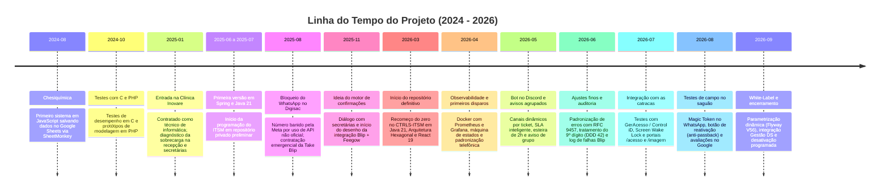
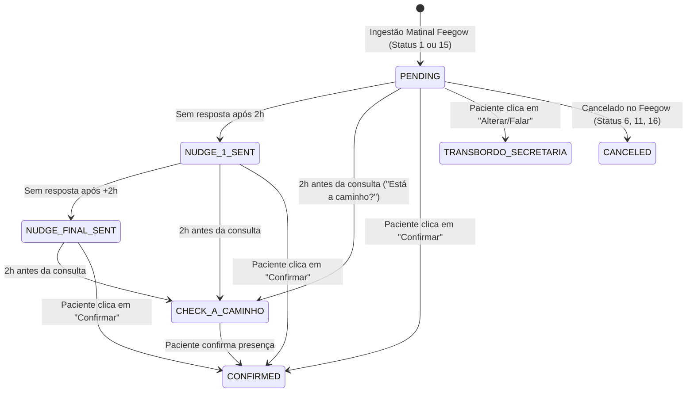
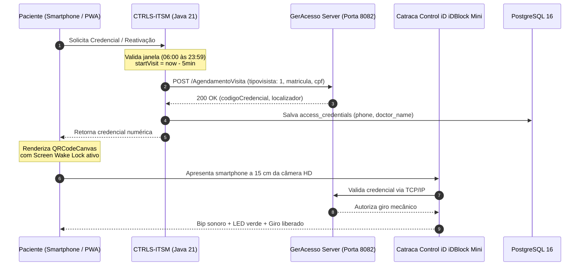

# CTRLS-ITSM: Relatório Técnico e Post-Mortem do Projeto

**Documento:** Relatório Técnico de Desenvolvimento e Post-Mortem  
**Autor:** Victor Gabriel Hass  
**Finalidade:** Portfólio de Engenharia de Software / Trabalho de Conclusão de Curso (TCC)  
**Período:** Agosto de 2024 a Setembro de 2026  
**Stack Principal:** Java 21 (Virtual Threads / Loom), Spring Boot 3 (Arquitetura Hexagonal), PostgreSQL 16, Redis, React 19, TypeScript, Vite, TailwindCSS, Docker, Take Blip (LIME Protocol), Feegow ERP API, Conta Azul V2 API, Control iD iDBlock Mini (GerAcesso), Discord JDA 5.  
**Situação:** Projeto finalizado e testado em produção. Desativado após a clínica optar por não manter a sustentação mensal do sistema.

---

## 1. Visão Geral

Este documento reúne os detalhes técnicos, a arquitetura e o histórico de desenvolvimento do **CTRLS-ITSM**. O sistema foi desenvolvido por iniciativa própria enquanto eu trabalhava como técnico de informática na Clínica Inovare (e na Clínica da Imagem, que opera integrada no mesmo edifício), com o objetivo de resolver gargalos reais da rotina das secretárias, recepcionistas e da equipe de suporte de TI.

A plataforma unificou cinco frentes principais:
1. **Confirmação Automática de Consultas (WhatsApp + Feegow ERP):** Disparos automáticos pelo WhatsApp (via Take Blip e API oficial da Meta) sincronizados com a agenda do Feegow ERP. O motor respeita particularidades de cada médico (como adiantar o horário na mensagem ou regras de antecedência para dermatologia) e tirou o peso das confirmações manuais das secretárias. Foram mais de 11.000 mensagens disparadas em 2 meses de uso, com picos de quase 500 mensagens em menos de 1 minuto.
2. **Controle de Acesso às Catracas (Control iD / GerAcesso):** Integração com as catracas eletrônicas do saguão do condomínio. O paciente recebe um QR Code dinâmico no celular e libera a catraca direto, sem precisar pegar fila na portaria para fazer cadastro manual e pegar crachá. Foram mais de 1.800 acessos liberados em 2 semanas de uso.
3. **Avaliações no Google Meu Negócio:** Envio automático de convite para avaliação no Google logo após a consulta ser concluída no Feegow. O link leva direto para a tela de 5 estrelas do perfil do médico ou da clínica. Em menos de 30 dias, a nota da clínica subiu de 3.3 para 3.8 estrelas.
4. **Conciliação Financeira (Conta Azul V2):** Baixa automática de honorários e emissão de recibos médicos via API com contingência em OpenPDF.
5. **Chamados de TI e Patrimônio (ITSM + Discord):** Central de chamados com cálculo de SLA em horário comercial da clínica, controle de insumos com método FIFO e bot no Discord (JDA 5) para atender e fechar chamados direto pelo celular.

---

## 2. Linha do Tempo e Histórico do Projeto (2024 – 2026)

Resumo das principais fases do projeto:



### 2.1 Fase Inicial (Agosto a Dezembro de 2024 — Chesiquímica)
O primeiro embrião do módulo de suporte começou em agosto de 2024 na Chesiquímica. O objetivo era aposentar formulários de papel e agilizar os chamados de manutenção. A primeira versão foi escrita em JavaScript, salvando dados em planilhas do Google Docs através da API do SheetMonkey.

Depois disso, fiz experimentos em C para testar consumo de memória e protótipos em PHP. Essa fase serviu para entender na prática como estruturar o ciclo de vida de um chamado, regras de prioridade e controle básico de peças.

### 2.2 Diagnóstico na Clínica, Primeira Versão e o Incidente do Digisac (2025)
Em janeiro de 2025, comecei a trabalhar como técnico de informática na Clínica Inovare (e na Clínica da Imagem, que funciona integrada no mesmo prédio). Minha função era o suporte padrão de TI: consertar computadores, configurar impressoras, manter a rede funcionando e atender os usuários. Criar sistemas não fazia parte do meu escopo contratual, mas no dia a dia da clínica era impossível não notar três problemas graves:

1. **A sobrecarga das secretárias:** Passavam horas ligando para dezenas de pacientes e enviando mensagens manuais no WhatsApp para confirmar as consultas do dia seguinte. Quem atendia mais de um médico não conseguia dar atenção presencial aos pacientes que chegavam ao consultório;
2. **As filas no térreo:** As recepcionistas da portaria precisavam atender ligações, responder mensagens no WhatsApp da clínica e, ao mesmo tempo, cadastrar manualmente cada visitante no sistema predial para entregar um crachá de catraca;
3. **Falta de controle no suporte de TI:** Chamados e peças de reposição não tinham registro centralizado de prazos ou consumo.

Para tentar organizar os atendimentos de informática, entre **junho e julho de 2025** comecei a programar uma **primeira etapa do ITSM** em **Spring Boot e Java 21** em um repositório privado. Esse projeto serviu como laboratório inicial para testar a modelagem de chamados e inventário. Mais tarde, arquivei esse código para recomeçar o sistema com uma arquitetura mais limpa e moderna.

Em **agosto de 2025**, a clínica passou por uma crise de comunicação: o número oficial de WhatsApp, que rodava no sistema Digisac, foi **banido pela Meta** porque a ferramenta utilizava conexões não oficiais. Para restabelecer o atendimento com urgência, a instituição contratou a plataforma oficial da **Take Blip** (Meta Cloud API).

Acompanhando esse cenário, em **novembro de 2025** tive a ideia de propor algo definitivo: integrar a API oficial do Blip diretamente ao prontuário eletrônico Feegow ERP, disparando lembretes e confirmações de forma automática. Comecei a conversar com as secretárias para mapear os detalhes da rotina delas e desenhei o fluxo da automação.

### 2.3 O que foi desenvolvido mês a mês (Março a Setembro de 2026)
Em março de 2026, reiniciei o projeto do zero no repositório definitivo (`CTRLS-ITSM`). Aproveitando o que já tinha aprendido, adotei **Arquitetura Hexagonal** em **Java 21**, usando **Virtual Threads (Project Loom)** para aguentar alto volume de conexões assíncronas com APIs externas sem travar threads do sistema operacional. No frontend, utilizei **React 19 com TypeScript** e Vite.

Abaixo está o resumo do que foi construído mês a mês:

#### Março de 2026: Estrutura inicial, chamados (ITSM) e financeiro
* **Arquitetura Hexagonal:** Separação estrita dos módulos de chamados (`ticket`), ativos (`asset`), estoque de TI (`inventory`) e financeiro (`finance`), mantendo as regras de negócio isoladas de bibliotecas externas.
* **Cálculo de SLA em horário comercial:** Algoritmo que calcula prazos considerando apenas o horário de funcionamento da clínica, além da regra `#🚨ParadaCrítica` para priorizar incidentes em consultórios.
* **Estoque FIFO:** Controle transacional de insumos de TI garantindo que itens mais antigos sejam baixados primeiro.
* **Base de Conhecimento (Ticket Deflection):** Módulo de perguntas frequentes para o usuário resolver dúvidas simples antes de abrir chamado.
* **Integração com o Conta Azul V2:** Renovação automática do token OAuth2 a cada 50 minutos com `ReentrantLock` para evitar expiração de sessão, validação em duas etapas (2FA/TOTP) para liberar o módulo financeiro, gerador de recibos médicos em OpenPDF e limitador de taxa com Redis (350ms) para respeitar as cotas da API.
* **Relatórios automáticos:** Envio programado de relatórios de chamados e estoque por E-mail e Discord.

#### Abril de 2026: Observabilidade, início das confirmações e recibos
* **Monitoramento com Docker:** Criação do ambiente com Prometheus, Grafana e Alertmanager para acompanhar uso de memória e requisições da JVM.
* **Recibos internos:** Busca de prestadores por CPF/CNPJ para emissão rápida de recibos assinados.
* **Início do motor de confirmações:** Primeiros clientes de conexão com o Feegow ERP (`FeegowClient`) e com a Take Blip via protocolo LIME.
* **Limpeza e padronização de telefones:** Tratamento para números brasileiros (DDI 55, DDD, nono dígito e formatação E.164).
* **Controle de status da consulta:** Criação da tabela `appointment_sessions` e da máquina de estados (`PENDING`, `CONFIRMED`, `CANCELED`).

#### Maio de 2026: Bot no Discord, avisos agrupados e esteira de lembretes
* **Bot de suporte no Discord (JDA 5):** Comandos de barra (`/chamado`, `/solicitar`, `/ti status`, `/meuschamados`, etc.) para abrir e acompanhar tickets pelo celular.
* **Canal dedicado por chamado:** O bot cria automaticamente um canal no Discord para cada ticket (`#nome-chamado-hexId`), com botões interativos para assumir ou concluir o chamado e alerta quando o SLA está perto de vencer (< 30 min).
* **Solução para o erro #132000 da Meta:** Ajuste no envio de templates para pacientes com mais de um exame ou consulta no mesmo dia (`aviso_agendamento_grupo`), evitando rejeição da API por parâmetros vazios.
* **Esteira de lembretes (Nudges):** Envio automático de reforço a cada 2 horas para pacientes que não responderam e disparo preventivo *"Você já está a caminho da clínica?"* 2 horas antes da consulta.

#### Junho de 2026: Padronização de erros, telefone do Paraná e logs de entrega
* **Padronização RFC 9457:** Formatação única de mensagens de erro com `ProblemDetail` e geração de um `traceId` compartilhado entre os logs do Spring Boot e o Axios no frontend.
* **Ajuste para o 9º dígito no Paraná:** Correção de divergências de operadoras com o DDD 42, garantindo que o número correto fosse chamado no WhatsApp.
* **Auditoria de entregas do Blip:** Tabela `BlipDeliveryFailureEntity` para registrar erros da Meta, identificar por que uma mensagem não chegou e disparar retentativas.
* **Ajuste no pool de conexões:** Desativação do *Open Session In View* (`spring.jpa.open-in-view=false`) para evitar travamento de conexões no HikariCP.

#### Julho de 2026: Catracas físicas, portais web e Screen Wake Lock
* **Conexão com as catracas Control iD:** Integração com o servidor GerAcesso (`172.25.100.106:8082`) que gerencia as catracas *iDBlock Mini* do condomínio.
* **Alinhamento com o time da GerAcesso:** Mapeamento do endpoint `/AgendamentoVisita` e análise de pacotes de rede para entender como o hardware processava a liberação.
* **O bug tipográfico da fabricante:** Descoberta de que o firmware da controladora exigia rigorosamente a grafia incorreta `"tipovisista": 1` para aceitar a visita.
* **Tolerância a diferenças de relógio:** Aplicação de janela retroativa de 5 minutos (`now.minusMinutes(5)`) para compensar dessincronizações de horário entre servidor e catraca.
* **Dois portais de acesso:** Portal `/acesso/:id` (identidade laranja para consultas gerais) e portal `/imagem` (identidade rosa/magenta `#B8004B` com cache no `localStorage` para a Clínica da Imagem).
* **Screen Wake Lock API:** Código no navegador para manter a tela do celular sempre acesa e no brilho ideal na hora de passar na catraca.

#### Agosto de 2026: Testes práticos no saguão, Magic Token e Google Reviews
* **Acompanhamento no saguão:** Fiquei presencialmente na portaria observando os pacientes usarem o QR Code nas catracas para ajustar pontos de atrito.
* **Magic Token HMAC:** Pacientes acessam seu QR Code pelo link do WhatsApp com um clique, sem precisar fazer login ou digitar senha.
* **Botão para destravar anti-passback:** Criação do botão *"Atualizar / Reativar QR Code"* na tela do passe para reemitir uma credencial em milissegundos caso a pessoa hesitasse na frente da catraca.
* **Abas para acompanhantes:** Separação clara na tela entre o paciente titular e seus acompanhantes, com botão para salvar a imagem na galeria e enviar o passe por WhatsApp.
* **Menus nativos no WhatsApp e Blip Flow V2:** Uso de listas interativas do WhatsApp (`application/json`) e ajuste no NLP para priorizar nomes de médicos e especialidades em vez de palavras soltas.
* **Otimização de banco (V49):** Criação de índices B-Tree em chaves estrangeiras para acelerar consultas frequentes.
* **Avaliações no Google:** Disparo automático pós-atendimento (Status 3 Feegow) com encurtador interno e contagem de cliques, subindo a nota da clínica no Google de 3.3 para 3.8 estrelas em menos de um mês.

#### Setembro de 2026: Arquitetura White-Label, Gestão DS e finalização
* **Integração com Gestão DS:** Ajustes no módulo de agendamentos para suportar clínicas que utilizam o sistema Gestão DS.
* **Arquitetura White-Label (Flyway V56):** Parametrização dinâmica de cores, logotipos e textos via banco (`system_settings`) e React Context, permitindo reutilizar o sistema em qualquer outra instituição.
* **Documentação técnica:** Organização de guias de arquitetura, manuais de implantação, referências de API e este relatório.
* **Desativação programada:** Desligamento seguro das instâncias nos servidores locais após a clínica optar por não manter a contratação.

---

## 3. Estrutura de Módulos no Backend

O backend foi organizado em Arquitetura Hexagonal, dividindo o sistema em contextos bem definidos. As integrações com sistemas externos (Feegow, Blip, Conta Azul, GerAcesso) ficam restritas aos adaptadores (`infrastructure.adapter.output`), de modo que alterações de API externa não afetam as regras de negócio:

```
br.dev.ctrls.itsm.modules/
├── access/         <-- Catracas Control iD, QR Codes dinâmicos, PWA e acompanhantes
├── appointment/    <-- Ingestão Feegow, confirmações no WhatsApp, nudges 2h e Google Review
├── finance/        <-- Conta Azul V2, conciliação e recibos OpenPDF
├── notification/   <-- Bot do Discord (JDA 5), comandos de barra e alertas de TI
├── ticket/         <-- Chamados ITSM, cálculo de SLA em horário comercial e Parada Crítica
├── asset/          <-- Inventário patrimonial (CMDB)
├── inventory/      <-- Estoque de insumos de informática e consumo FIFO
├── vault/          <-- Cofre de senhas criptografado (AES-256-GCM) e 2FA/TOTP
├── audit/          <-- Trilha de auditoria LGPD com Correlation IDs
├── settings/       <-- Configurações gerais e motor White-Label dinâmico (V56)
├── user/           <-- Usuários, perfis de acesso (RBAC) e setores
└── ...             <-- Módulos auxiliares: auth, analytics, communication, etc.
```

---

## 4. Desafios Técnicos e Soluções Implementadas

### 4.1 Confirmações no WhatsApp (Take Blip & Feegow ERP)

#### Como surgiu a ideia e a diferença de custos em relação ao mercado:
Como técnico de informática da clínica, minha rotina diária era o suporte técnico. Porém, acompanhando o dia a dia, era claro o desgaste das secretárias: passavam grande parte do expediente ligando para pacientes ou enviando mensagens manuais para confirmar as consultas do dia seguinte. Quando uma secretária atendia dois ou três consultórios movimentados, mal sobrava tempo para receber os pacientes no balcão.

Após a perda do número no Digisac e a migração para a Take Blip, a administração da clínica chegou a solicitar um orçamento oficial à Take Blip para criar um robô de confirmação. A proposta comercial enviada tinha valores altos:
* **R$ 18.000,00** de taxa de implantação;
* **R$ 2.000,00 mensais** de manutenção;
* **R$ 15.000,00** adicionais no encerramento da entrega;
* **Total de R$ 33.000,00 a R$ 35.000,00 de custo inicial**, mais a mensalidade, para um robô genérico que não considerava as regras específicas de cada médico.

Percebendo que a clínica não investiria esse valor e que a sobrecarga das secretárias continuaria, assumi o desafio por iniciativa própria sem cobrar nada pelo desenvolvimento. Meu modelo era apenas a mensalidade de **R$ 80,00 por médico ativo** utilizando a ferramenta. A administração chegou a pagar uma fatura inicial de **R$ 2.800,00** (correspondente aos médicos ativos que estavam usando o sistema), mas tratou esse pagamento como se estivesse adquirindo o sistema de forma definitiva e permanente, recusando-se a manter a mensalidade de suporte nos meses seguintes.

#### Regras específicas por especialidade médica:
Ao invés de fazer um fluxo genérico, conversei com as secretárias para entender a dinâmica de cada consultório e programei regras específicas no Feegow:

1. **Adiantar 10 minutos na mensagem:**
   * Certos médicos sofriam com atrasos frequentes porque os pacientes chegavam exatamente no horário marcado, empurrando o início do atendimento.
   * Criei uma regra que adiantava em 10 minutos o horário informado na mensagem (ex: consulta marcada às 14h00 no Feegow era comunicada como 13h50). Isso garantiu que o paciente chegasse com tempo para triagem e recepção.
2. **Confirmação D+2 para Dermatologia e Procedimentos:**
   * Consultas dermatológicas e biópsias exigiam preparo prévio e compra de medicamentos, precisando de confirmação com 2 dias de antecedência (D+2).
   * O sistema disparava essas mensagens exclusivamente às quartas-feiras (para consultas de sexta) e quintas-feiras (para consultas de sábado).
3. **Lembretes automáticos a cada 2 horas:**
   * Se o paciente visualizasse a mensagem e não respondesse, o `MonitorAppointmentNudgesUseCase` enviava lembretes automáticos a cada 2 horas.
4. **Checagem preventiva 2 horas antes da consulta:**
   * Duas horas antes do horário marcado, o robô enviava uma pergunta simples: *"Você já está a caminho da clínica?"*. Isso reduziu desistências de última hora e ajudou a recepção a preencher vagas com pacientes de encaixe.
5. **Resultados em produção:**
   * O sistema **reduziu comprovadamente as faltas** e tirou o peso das confirmações manuais da rotina das secretárias.
   * **Mais de 11.000 mensagens disparadas em 2 meses de produção.**
   * **Vazão de quase 500 mensagens em menos de 1 minuto:** Graças ao uso de **Java 21 com Virtual Threads**, as requisições assíncronas para a Take Blip e para o Feegow rodavam sem travar recursos do servidor.




*Figura 1: Painel administrativo do motor de confirmações em produção: 68 médicos mapeados no Feegow ERP, 46 ativos recebendo automações, status do motor em tempo real e opção de disparo manual com data alvo.*


*Figura 2: Registro de auditoria no PostgreSQL: consulta à tabela `appointment_sessions` comprovando 10.280 sessões de confirmação processadas pelo motor.*

#### Problemas práticos resolvidos no WhatsApp:
1. **Transbordo direto para a secretária certa no Blip Desk:**
   * *Problema:* Quando o paciente pedia para remarcar ou falar com atendente, a mensagem caía na fila geral do Blip Desk, sobrecarregando uma única atendente.
   * *Solução:* Programei o `BlipContactClientAdapter` para atualizar o contato no roteador e no túnel do Desk simultaneamente, injetando o nome do médico e o setor. A mensagem já caía direto na tela da secretária responsável por aquele consultório.
2. **Erro #132000 da Meta em avisos com múltiplos procedimentos:**
   * *Problema:* O envio de lembretes para pacientes com mais de um exame no mesmo dia (`aviso_agendamento_grupo`) era rejeitado pela API da Meta com o erro `Validation failed (#132000)`.
   * *Solução:* A Meta rejeita o campo `messageParams` quando o template não tem variáveis dinâmicas. O código foi ajustado para remover o nó JSON quando ele for nulo.
3. **Trava contra regressão de status:**
   * Quando o paciente confirmava pelo WhatsApp, o status local recebia uma trava para evitar que uma sincronização posterior do Feegow sobrescrevesse a confirmação como pendente.

---

### 4.2 Catracas Físicas e Portaria com QR Code (Control iD / GerAcesso)

#### Como surgiu o sistema de QR Code:
Com o WhatsApp funcionando, o foco passou a ser o saguão do condomínio. As recepcionistas do térreo ficavam sobrecarregadas: atendiam telefone, respondiam mensagens e precisavam cadastrar manualmente cada paciente para entregar um crachá plástico de catraca. O resultado eram filas diárias no balcão.

A solução foi integrar as catracas ao sistema: se o paciente já confirmou a consulta pelo WhatsApp ou fez o pré-cadastro no celular, ele recebe um QR Code digital. Chegando na clínica, basta aproximar o smartphone do leitor da catraca e passar direto. Durante as **duas semanas em que rodou em produção**, o sistema gerou **mais de 1.800 credenciais digitais de acesso**, eliminando as filas na portaria.

#### Alinhamento com a GerAcesso e testes de bancada:
* Participei de reuniões técnicas com a equipe da GerAcesso (responsável pelo software que se comunica com as catracas *Control iD iDBlock Mini* no prédio).
* Analisei as requisições de rede, mapeei o endpoint `/AgendamentoVisita` e entendi como o sistema validava crachás e regras de anti-passback.
* Fiz testes práticos na rede interna (`172.25.100.106:8082`) até o fluxo ficar estável para uso real.



#### Testes no saguão e ajustes práticos de uso:
Fiquei presencialmente no térreo durante as duas semanas de produção nas catracas para ver como as pessoas usavam a solução no mundo real. Isso permitiu corrigir detalhes que só aparecem na prática:
1. **O bug de digitação no sistema da GerAcesso (`tipovisista: 1`):**
   * A controladora recusava requisições que usavam o nome correto `tipoVisita`. Analisando os pacotes de rede, descobri que o firmware esperava exatamente a grafia errada `"tipovisista": 1` (commit `2aa38909`).
2. **Hesitação na catraca e anti-passback:**
   * Às vezes o paciente encostava o celular, a catraca liberava, mas se ele hesitasse antes de empurrar o braço mecânico, o leitor bloqueava a credencial por segurança.
   * *Solução:* Adicionei o botão *"Atualizar / Reativar QR Code"* logo abaixo da imagem do código (`db58ec73`). Ao clicar, o sistema gera uma nova credencial em milissegundos, com retroatividade de 5 minutos para absorver eventuais diferenças de horário entre servidores e catracas.
3. **Ergonomia e tela do celular:**
   * Pacientes encostavam a tela do celular no vidro do leitor: adicionei uma ilustração simples indicando a distância ideal de cerca de **15 cm**.
   * Modo escuro do celular invertendo cores do QR Code: forcei um fundo branco estático no container CSS.
   * A tela do celular apagava na fila: ativei a **Screen Wake Lock API** para manter o visor aceso enquanto o QR Code estivesse aberto.
   * Adicionei opção para baixar o cartão como imagem na galeria do celular e corrigi o zoom automático indesejado no Safari do iPhone.
4. **Abas para acompanhantes:**
   * Criei abas na interface para separar o QR Code do paciente e dos seus acompanhantes, facilitando o envio individual por WhatsApp e evitando cadastros duplicados.


*Figura 3: Registro de auditoria no PostgreSQL: consulta à tabela `access_credentials` comprovando 1.797 credenciais digitais de acesso geradas e liberadas fisicamente nas catracas.*

---

### 4.3 Portais de Acesso para as Duas Unidades

Como o prédio atendia duas operações diferentes, criei dois portais responsivos:

#### 1. Portal das Consultas (`/acesso/:id`):
* Focado nos pacientes dos consultórios médicos da clínica geral e especialidades.
* Identidade visual em tons de **laranja** (`#FFA145`, `#E08328`).
* Integrado à busca de agendamentos no Feegow por CPF e telefone.

#### 2. Portal da Clínica da Imagem (`/imagem`):
* A **Clínica da Imagem** (exames de tomografia, ressonância, raio-X e ultrassom) não utilizava o Feegow ERP nem o fluxo de confirmações no WhatsApp, mas seus pacientes precisavam passar pelas mesmas catracas do prédio.
* Criei o portal `/imagem` com a identidade visual própria da instituição: tons de **rosa e magenta** (primária `#B8004B`, escuro `#7A002E`).
* **Cache offline:** O cartão é salvo no `localStorage` do celular no momento do cadastro. Se o paciente chegar na clínica sem sinal de internet, o QR Code abre normalmente na tela.


*Figura 4: Interface web responsiva do totem de autoatendimento (Clínica da Imagem - Unidade Inovare), permitindo consulta de agendamento por CPF, seleção de datas e inclusão de acompanhantes.*


*Figura 5: Modal de cadastro rápido de acompanhante, gerando credenciais autorizadas vinculadas no mesmo fluxo.*


*Figura 6: Cartão digital de acesso gerado no smartphone do paciente com QR Code dinâmico, código de backup, orientações ergonômicas de leitura (15 cm), sala/consultório e botão para adicionar à agenda.*

---

### 4.4 Avaliações no Google Meu Negócio

#### O problema da nota pública:
A nota da clínica no Google Meu Negócio estava baixa: **3.3 estrelas**. Postagens em redes sociais não estavam funcionando para motivar os pacientes a avaliar.

#### A solução implementada:
1. **Varredura automática:** O backend buscava periodicamente consultas concluídas no Feegow com status `StatusID = 3` (*Atendido*).
2. **Encaminhamento dinâmico:** Se o médico atendente possuía página própria verificada no Google, o paciente recebia o link direto para avaliar o médico. Se não tivesse, o link ia para a página geral da clínica.
3. **Encurtador interno:** Como botões interativos do WhatsApp limitam o tamanho de links, criei um encurtador próprio (`/v1/doctors/configurations/review/{hash}`) que registrava métricas de cliques e abria direto a tela de 5 estrelas do Google.
4. **Resultado:** Em **menos de 1 mês**, a nota média da clínica subiu de **3.3 para 3.8 estrelas**, trazendo dezenas de novas avaliações positivas espontâneas.

---

### 4.5 Módulo Financeiro (Conta Azul V2)
* **Renovação de tokens OAuth2:** Renovação programada a cada 50 minutos protegida por `ReentrantLock`, evitando o erro de sessão expirada (`invalid_grant`).
* **Recibos médicos em PDF (OpenPDF):** Gerador local de recibos padronizados com os dados da baixa financeira, enviado por e-mail caso a API do Conta Azul demorasse para disponibilizar o comprovante.
* **Controle de taxa com Redis:** Limite de chamadas com espaçamento de 350ms para não ultrapassar a cota da API financeira.

---

### 4.6 Central de Suporte, Estoque e Bot no Discord
* **SLA em horário comercial:** Cálculo de prazos que conta apenas as horas úteis de expediente da clínica, pausando noites e finais de semana.
* **Regra de Parada Crítica (`#🚨ParadaCrítica`):** Incidentes em consultórios ou máquinas prioritárias entravam automaticamente com meta de atendimento de **menos de 1 hora útil**.
* **Bot interativo no Discord (JDA 5):** Permite que a equipe técnica atenda, consulte e finalize chamados pelo celular, sem precisar acessar o computador.
* **Prevenção de vazamento de conexões:** Desativação de *Open Session In View* (`spring.jpa.open-in-view=false`) para evitar travamento do pool de conexões do PostgreSQL por requisições de terceiros lentas.


*Figura 7: Dashboard executivo da Central de Chamados: 244 tickets totais atendidos, 235 resolvidos (taxa de resolução de 96,3%), controle de SLA e métricas por categorias.*


*Figura 8: Módulo de suprimentos e almoxarifado de TI com controle de saldo atual, alertas visuais de reposição e registro de novas entradas por lote.*


*Figura 9: Rastreabilidade patrimonial do CMDB: equipamentos de hardware vinculados a consultórios, setores e usuários responsáveis.*


*Figura 10: Camada de segurança e autenticação em dois fatores (TOTP de 6 dígitos) exigida para acesso ao módulo financeiro e relatórios confidenciais.*


*Figura 11: Módulo de agendamento automático de relatórios periódicos de estoque e chamados com despacho multicanal via E-mail e Discord.*

#### Como funciona o atendimento pelo Discord (JDA 5):
1. **Comandos de barra:** Comandos com auto-complete (`/chamado`, `/solicitar`, `/ti status`, `/meuschamados`, `/vincular`, `/ajuda`), permitindo registrar incidentes e consultar status pelo celular.
2. **Canal exclusivo por ticket:** Ao abrir um chamado, o bot cria automaticamente um canal de texto exclusivo (`#desativacao-do-sistema-ctrls-na-clinica-29e31f76`), calcula o prazo de SLA e coloca botões interativos (`Assumir Chamado`, `Resolver Chamado`).
3. **Atribuição e encerramento:** Ao clicar em *"Assumir Chamado"*, a mensagem é fixada e o técnico é registrado no banco de dados. Ao concluir, o parecer técnico fica registrado no Discord, com botão para eventual reabertura.


*Figura 12: Automação ITSM via Discord (JDA 5): catálogo de Slash Commands registrados (`/chamado`, `/solicitar`, `/ti status`, `/meuschamados`, `/vincular`, `/ajuda`) com auto-complete nativo.*


*Figura 13: Notificação imediata de abertura de chamado via comando `/chamado`: geração de identificador hexadecimal (`#29E31F76`), metadados de solicitante e nível de prioridade.*


*Figura 14: Orquestração reativa do Discord Bot: criação automática de canal exclusivo para o chamado, cálculo de prazo de SLA em horas úteis e botões interativos (`Assumir Chamado`, `Resolver Chamado`).*


*Figura 15: Parecer técnico e resolução do chamado registrados no Discord e sincronizados instantaneamente com o banco relacional PostgreSQL, incluindo botão para eventual reabertura.*

---

## 5. Resumo das Entregas Técnicas

| Módulo | O que foi implementado | Tecnologias | Resultados práticos |
|---|---|---|---|
| **Confirmações no WhatsApp** | Ingestão Feegow D+0 a D+3, encaminhamento para a secretária certa no Desk, lembretes a cada 2h, checagem "A caminho?", horários adiantados (10 min), D+2 Dermatologia | Take Blip, LIME Protocol, Meta Cloud API, Feegow REST, Java 21 Loom | **Redução de faltas**, alívio da rotina das secretárias. **+11.000 mensagens em 2 meses**; picos de **quase 500 mensagens/dia em < 1 minuto**. |
| **Catracas e Acesso IoT** | Catracas Control iD iDBlock Mini, GerAcesso REST, botão de reativação imediata, portais `/imagem` e `/acesso`, Screen Wake Lock | Java 21, Virtual Threads, React 19, LocalStorage, Screen Wake Lock | **Fim das filas na portaria do térreo**, liberação direta de pacientes e acompanhantes sem crachá plástico. **+1.800 credenciais geradas em 2 semanas**. |
| **Avaliações no Google** | Disparo pós-atendimento (Status 3 Feegow), link individual para o médico ou institucional, encurtador interno com telemetria | Spring Boot, Feegow API, Google My Business | **Aumento da nota do Google de 3.3 para 3.8 estrelas em menos de 1 mês**. |
| **Portal Clínica da Imagem** | Portal `/imagem`, tema magenta (`#B8004B`), armazenamento offline no celular | React 19, LocalStorage, CSS | Atendimento aos pacientes de diagnóstico por imagem sem depender do Feegow. |
| **Financeiro** | Sincronização Conta Azul V2, gerador de recibos em OpenPDF, controle de concorrência no token OAuth2 | Conta Azul REST, OpenPDF, Redis Rate Limiter | Envio de recibos por e-mail e conciliação contábil automatizada. |
| **Chamados (ITSM)** | SLA em horário comercial, Parada Crítica (1h), bot interativo no Discord com botões | Discord JDA 5, PostgreSQL 16, Spring Data JPA | Atendimento a incidentes críticos em consultórios em menos de 60 minutos úteis. |
| **Estoque de Informática** | Baixa transacional com algoritmo FIFO, rastreamento de lotes e alertas de estoque mínimo | PostgreSQL 16, Propagation.MANDATORY | Controle de custos de insumos por máquina e setor. |
| **Segurança e LGPD** | Criptografia AES-256-GCM, autenticação em dois fatores (TOTP), trilha de auditoria imutável | JCE, Google Authenticator, PostgreSQL | Proteção de senhas, chaves de API e logs com Correlation ID. |
| **White-Label** | Configuração de cores, logos e nomes via banco de dados (`system_settings`) e painel administrativo | Flyway V56, React Context, Tailwind CSS v4 | Sistema desacoplado para implantação sob marca própria em outras clínicas. |

---

## 6. Encerramento, Valores e Autoria

O projeto CTRLS-ITSM mostrou na prática que é possível resolver gargalos reais de uma clínica médica unindo observação do dia a dia da operação (secretárias e recepção) com desenvolvimento moderno de software e integração de hardware.

### Resumo comercial e financeiro:
* Uma empresa de fora cobraria entre **R$ 33.000,00 e R$ 35.000,00** de desenvolvimento mais **R$ 2.000,00 mensais** apenas para fazer um robô básico e genérico de WhatsApp;
* Desenvolvi a plataforma completa (18 módulos, catracas com QR Code, chamados com bot no Discord, financeiro e avaliações no Google) por iniciativa própria, sem cobrar taxa alguma de desenvolvimento ou implantação;
* O único custo proposto para a clínica era uma mensalidade de **R$ 80,00 por médico ativo** que utilizasse o sistema;
* A instituição pagou uma fatura de **R$ 2.800,00** referente à mensalidade dos médicos daquele período, porém agiu como se esse valor único quitasse a compra definitiva de todo o ecossistema. Quando reforcei que a sustentação das integrações exigia a continuidade da mensalidade acordada, a administração achou caro e optou por não manter o serviço. Por essa razão, desativei os serviços nos servidores locais e arquivei o projeto.

### Autoria e próximos passos:
Todo o código-fonte, arquitetura de software, esquemas de banco de dados (migrações Flyway V1 a V56), integrações de hardware e documentações técnicas foram criados integralmente por **Victor Gabriel Hass**.

O projeto está pronto para:
1. **Trabalho de Conclusão de Curso (TCC):** Apresentação como estudo de caso prático de engenharia de software e automação em saúde.
2. **Portfólio Profissional:** Demonstração prática de iniciativa própria, resolução de problemas reais de hardware e software, e entrega de valor comprovado em ambiente de produção.
3. **Produto White-Label (CTRLS-ITSM):** Estruturado e empacotado para ser implantado sob marca própria em qualquer outra clínica ou hospital.
